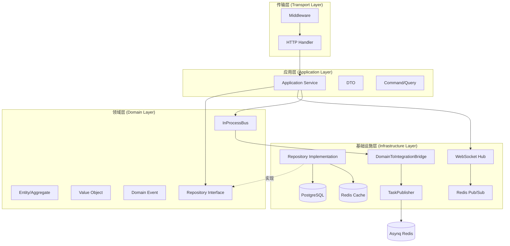
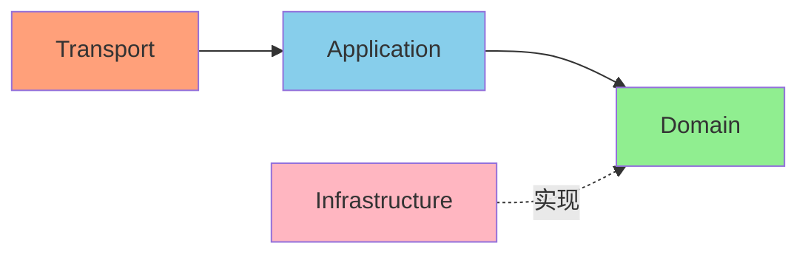
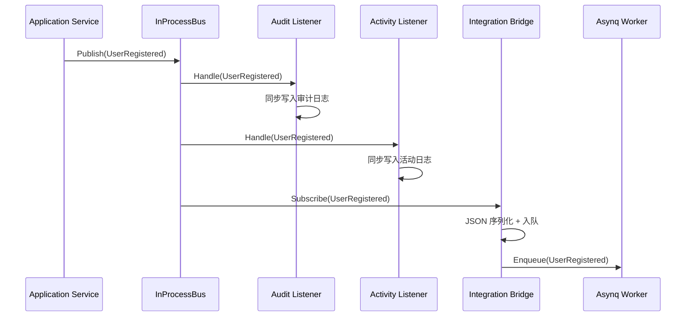
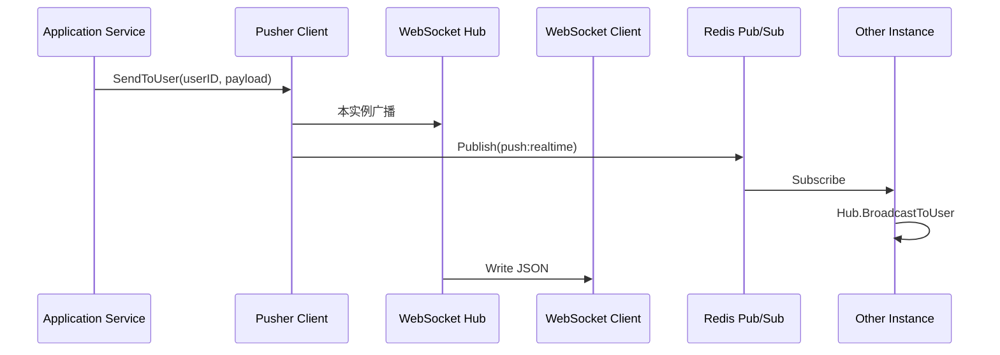

# DDD 架构设计文档

本文档详细说明项目的领域驱动设计（DDD）架构理念和实现方式。

## 📋 目录

- [架构概述](#架构概述)
- [四层架构](#四层架构)
- [依赖规则](#依赖规则)
- [领域层设计](#领域层设计)
- [应用层设计](#应用层设计)
- [基础设施层设计](#基础设施层设计)
- [传输层设计](#传输层设计)
- [事件驱动架构](#事件驱动架构)
- [代码组织](#代码组织)

## 架构概述

本项目采用**DDD 四层架构**，严格遵循依赖倒置原则，确保领域逻辑的独立性和可测试性。



**核心原则**：
1. **领域层零依赖**：不依赖任何外部框架或基础设施
2. **依赖倒置**：高层模块定义接口，低层模块实现
3. **单向依赖**：外层依赖内层，内层不依赖外层

## 四层架构

### 1. 领域层（Domain Layer）

**位置**：`internal/domain/`

**职责**：
- 定义业务实体（Entity）和聚合根（Aggregate Root）
- 定义值对象（Value Object）
- 定义领域事件（Domain Event）
- 定义仓储接口（Repository Interface）
- 封装核心业务规则

**特点**：
- ✅ **零外部依赖**：仅依赖 Go 标准库
- ✅ **纯粹的业务逻辑**：不涉及数据库、HTTP 等技术细节
- ✅ **高度可测试**：无需 Mock 外部依赖

**示例**：
```
internal/domain/
└── user/
    ├── entity.go           # User 聚合根
    ├── value_objects.go    # Email, Password 值对象
    ├── events.go           # UserRegistered, UserLoggedIn 领域事件
    └── repository.go       # UserRepository 接口定义
```

**代码示例**：
```go
// User 聚合根
type User struct {
    ID             string
    Email          string
    Password       string    // 密码哈希
    EmailVerified  bool
    Locked         bool
    FailedAttempts int
    CreatedAt      time.Time
    UpdatedAt      time.Time
}

// NewUser 工厂方法（封装创建逻辑）
func NewUser(email, password string) (*User, error) {
    // 验证邮箱格式
    if !isValidEmail(email) {
        return nil, ErrInvalidEmail
    }
    
    // 验证密码强度
    if !isStrongPassword(password) {
        return nil, ErrWeakPassword
    }
    
    // 密码加密
    hashedPassword, err := bcrypt.GenerateFromPassword(
        []byte(password), bcrypt.DefaultCost)
    
    return &User{
        ID:             generateID(),
        Email:          email,
        Password:       string(hashedPassword),
        EmailVerified:  false,
        CreatedAt:      time.Now(),
        UpdatedAt:      time.Now(),
    }, nil
}

// VerifyPassword 领域行为
func (u *User) VerifyPassword(password string) bool {
    return bcrypt.CompareHashAndPassword(
        []byte(u.Password), []byte(password)) == nil
}
```

### 2. 应用层（Application Layer）

**位置**：`internal/app/`

**职责**：
- 编排领域对象完成用例（Use Case）
- 定义 DTO（Data Transfer Object）
- 定义 Command/Query 对象
- 协调多个聚合根的操作
- 发布领域事件

**特点**：
- ✅ **薄应用层**：仅编排逻辑，不包含业务规则
- ✅ **事务管理**：协调数据库事务
- ✅ **事件发布**：发布领域事件到事件总线

**示例**：
```
internal/app/
└── authentication/
    ├── service.go          # 认证应用服务
    ├── dto.go              # 请求/响应 DTO
    ├── mapper.go           # DTO 与领域对象转换
    └── token_service.go    # Token 生成服务
```

**代码示例**：
```go
// RegisterCommand 注册命令
type RegisterCommand struct {
    Email    string
    Password string
}

// Register 用例编排
func (s *Service) Register(ctx context.Context, cmd RegisterCommand) (*AuthResponse, error) {
    // 1. 检查邮箱唯一性（应用层规则）
    if s.userRepo.ExistsByEmail(ctx, cmd.Email) {
        return nil, ErrEmailAlreadyExists
    }
    
    // 2. 创建用户（领域层负责业务规则）
    user, err := user.NewUser(cmd.Email, cmd.Password)
    if err != nil {
        return nil, err
    }
    
    // 3. 持久化（基础设施层）
    if err := s.userRepo.Create(ctx, user); err != nil {
        return nil, err
    }
    
    // 4. 生成 Token（应用服务）
    tokens, err := s.tokenService.GenerateTokens(ctx, user.ID, user.Email)
    
    // 5. 发布领域事件（同步，经过 InProcessBus）
    s.eventBus.Publish(ctx, user.NewUserRegisteredEvent(user.ID, user.Email))
    
    return &AuthResponse{
        User:         toUserDTO(user),
        AccessToken:  tokens.AccessToken,
        RefreshToken: tokens.RefreshToken,
    }, nil
}
```

### 3. 基础设施层（Infrastructure Layer）

**位置**：`internal/infra/`

**职责**：
- 实现领域层定义的接口（如 Repository）
- 数据库访问（GORM）
- Redis 缓存
- 消息队列（Event Bus）
- 外部服务集成

**特点**：
- ✅ **实现细节**：具体的技术实现
- ✅ **可替换**：更换数据库/缓存不影响领域层
- ✅ **依赖注入**：通过构造函数注入依赖

**示例**：
```
internal/infra/
├── repository/
│   ├── user.go           # UserRepository 实现
│   ├── activity_log.go   # ActivityLogRepository 实现
│   └── audit_log.go      # AuditLogRepository 实现
├── persistence/
│   ├── db.go             # 数据库连接
│   └── redis.go          # Redis 连接
├── redis/
│   ├── token_store.go    # Token 存储
│   └── device_store.go   # 设备会话存储
└── messaging/
    └── event_bus.go      # 事件总线实现
```

**代码示例**：
```go
// UserRepository 实现领域层定义的接口
type UserRepository struct {
    db *gorm.DB
}

// Create 实现 Repository 接口的 Create 方法
func (r *UserRepository) Create(ctx context.Context, u *user.User) error {
    // 领域对象 -> 持久化对象
    po := &UserPO{
        ID:             u.ID,
        Email:          u.Email,
        PasswordHash:   u.Password,
        EmailVerified:  u.EmailVerified,
        CreatedAt:      u.CreatedAt,
        UpdatedAt:      u.UpdatedAt,
    }
    
    return r.db.WithContext(ctx).Create(&po).Error
}

// FindByID 实现 Repository 接口的 FindByID 方法
func (r *UserRepository) FindByID(ctx context.Context, id string) (*user.User, error) {
    var po UserPO
    if err := r.db.WithContext(ctx).First(&po, "id = ?", id).Error; err != nil {
        return nil, err
    }
    
    // 持久化对象 -> 领域对象
    return &user.User{
        ID:             po.ID,
        Email:          po.Email,
        Password:       po.PasswordHash,
        EmailVerified:  po.EmailVerified,
        CreatedAt:      po.CreatedAt,
        UpdatedAt:      po.UpdatedAt,
    }, nil
}
```

### 4. 传输层（Transport Layer）

**位置**：`internal/transport/`

**职责**：
- HTTP Handler（Gin）
- Middleware（认证、日志、限流等）
- 请求验证
- 响应格式化
- Worker 任务处理

**特点**：
- ✅ **薄控制器**：仅处理 HTTP 细节，不包含业务逻辑
- ✅ **统一响应**：标准化响应格式（trace_id + timestamp）
- ✅ **错误处理**：统一错误处理中间件

**示例**：
```
internal/transport/
└── http/
    ├── handlers/
    │   ├── auth.go         # 认证 Handler
    │   └── user.go         # 用户 Handler
    ├── middleware/
    │   ├── auth.go         # JWT 认证中间件
    │   ├── trace_id.go     # Trace ID 中间件
    │   └── error.go        # 错误处理中间件
    └── response/
        └── response.go     # 响应辅助函数
```

**代码示例**：
```go
// Register 处理用户注册（薄控制器）
func (h *AuthHandler) Register(c *gin.Context) {
    // 1. 解析请求
    var req RegisterRequest
    if err := c.ShouldBindJSON(&req); err != nil {
        response.Error(c, validationErr.FromGinError(err))
        return
    }
    
    // 2. 转换为 Command
    cmd := authentication.RegisterCommand{
        Email:    req.Email,
        Password: req.Password,
    }
    
    // 3. 调用应用服务
    resp, err := h.service.Register(c.Request.Context(), cmd)
    if err != nil {
        response.Error(c, err)
        return
    }
    
    // 4. 返回响应
    response.Created(c, authentication.ToAuthResponse(resp))
}
```

## 依赖规则

### 依赖方向



**规则**：
1. ✅ 传输层 → 应用层
2. ✅ 应用层 → 领域层
3. ✅ 基础设施层 → 领域层（实现接口）
4. ❌ 领域层不依赖任何外层

### 依赖注入

```go
// cmd/api/main.go
func main() {
    // 1. 初始化基础设施
    db := persistence.NewDatabase(config)
    redis := persistence.NewRedis(config)
    asynqClient := asynq.NewClient(...)
    
    // 2. 初始化仓储（注入基础设施）
    userRepo := repository.NewUserRepository(db)
    
    // 3. 创建进程内事件总线 + 桥接器
    inProcessBus := events.NewInProcessBus()
    bridge := messaging.NewBridge(asynqClient)
    bridge.SubscribeTo(inProcessBus)
    
    // 4. 初始化应用服务（注入 Bus 接口）
    authService := authentication.NewService(userRepo, tokenService, inProcessBus)
    
    // 5. 初始化 Handler（注入应用服务）
    authHandler := handlers.NewAuthHandler(authService)
    
    // 6. 注册路由
    router := transport.NewRouter(authHandler)
}
```

## 领域层设计

### 聚合根（Aggregate Root）

**定义**：聚合根是聚合的入口，负责维护聚合内的一致性。

```go
// User 聚合根
type User struct {
    ID             string
    Email          string
    Password       string
    EmailVerified  bool
    Locked         bool
    FailedAttempts int
    CreatedAt      time.Time
    UpdatedAt      time.Time
}

// 聚合根行为（封装业务规则）
func (u *User) RecordFailedLogin() {
    u.FailedAttempts++
    if u.FailedAttempts >= 5 {
        u.Locked = true
    }
    u.UpdatedAt = time.Now()
}

func (u *User) ResetFailedAttempts() {
    u.FailedAttempts = 0
    u.UpdatedAt = time.Now()
}
```

### 值对象（Value Object）

**定义**：值对象通过属性值标识，无唯一标识。

```go
// Email 值对象
type Email struct {
    value string
}

func NewEmail(email string) (*Email, error) {
    if !isValidEmail(email) {
        return nil, ErrInvalidEmail
    }
    return &Email{value: strings.ToLower(email)}, nil
}

func (e *Email) String() string {
    return e.value
}
```

### 领域事件（Domain Event）

**定义**：领域事件表示领域中发生的重要事情。

```go
// UserRegistered 领域事件
type UserRegistered struct {
    UserID    string    `json:"user_id"`
    Email     string    `json:"email"`
    Timestamp time.Time `json:"timestamp"`
}

// EventName 返回事件名称
func (e *UserRegistered) EventName() string { return "user.registered" }

// OccurredAt 返回事件发生时间
func (e *UserRegistered) OccurredAt() time.Time { return e.Timestamp }
```

## 应用层设计

### 用例编排

应用层负责编排多个领域对象完成复杂的业务流程：

```go
func (s *Service) ChangePassword(ctx context.Context, cmd ChangePasswordCommand) error {
    // 1. 加载聚合根
    user, err := s.userRepo.FindByID(ctx, cmd.UserID)
    if err != nil {
        return err
    }
    
    // 2. 验证旧密码（领域行为）
    if !user.VerifyPassword(cmd.OldPassword) {
        return ErrInvalidPassword
    }
    
    // 3. 更新密码（领域行为）
    if err := user.UpdatePassword(cmd.NewPassword); err != nil {
        return err
    }
    
    // 4. 持久化
    if err := s.userRepo.Update(ctx, user); err != nil {
        return err
    }
    
    // 5. 发布领域事件
    s.eventBus.Publish(user.NewPasswordChangedEvent(user.ID))
    
    return nil
}
```

## 基础设施层设计

### 仓储实现

基础设施层实现领域层定义的接口：

```go
// 领域层定义接口
type UserRepository interface {
    FindByID(ctx context.Context, id string) (*User, error)
    Create(ctx context.Context, user *User) error
    Update(ctx context.Context, user *User) error
    Delete(ctx context.Context, id string) error
}

// 基础设施层实现
type UserRepository struct {
    db *gorm.DB
}

func (r *UserRepository) FindByID(ctx context.Context, id string) (*User, error) {
    // 实现细节...
}
```

### 对象映射

领域对象与持久化对象的转换：

```go
// 领域对象 -> 持久化对象
func toUserPO(u *user.User) *UserPO {
    return &UserPO{
        ID:             u.ID,
        Email:          u.Email,
        PasswordHash:   u.Password,
        EmailVerified:  u.EmailVerified,
        CreatedAt:      u.CreatedAt,
        UpdatedAt:      u.UpdatedAt,
    }
}

// 持久化对象 -> 领域对象
func toUserDomain(po *UserPO) *user.User {
    return &user.User{
        ID:             po.ID,
        Email:          po.Email,
        Password:       po.PasswordHash,
        EmailVerified:  po.EmailVerified,
        CreatedAt:      po.CreatedAt,
        UpdatedAt:      po.UpdatedAt,
    }
}
```

## 事件驱动架构

### 双层事件总线模型



**代码示例**：
```go
// 应用服务发布事件（注入 events.Bus 接口）
type Service struct {
    userRepo user.UserRepository
    eventBus events.Bus  // 进程内事件总线
}

func (s *Service) Register(ctx context.Context, cmd RegisterCommand) (*AuthResponse, error) {
    // ... 创建用户
    
    // 发布领域事件（经过 InProcessBus，同步调用所有 Listener）
    s.eventBus.Publish(ctx, user.NewUserRegisteredEvent(user.ID, user.Email))
    
    return response, nil
}

// 监听器处理事件（直接写 Repository）
type AuditLogListener struct {
    repo auditlog.Repository
}

func (l *AuditLogListener) HandleUserRegistered(ctx context.Context, evt events.DomainEvent) error {
    e := evt.(*user.UserRegistered)
    log := auditlog.NewAuditLog(
        e.EventName(),
        e.UserID,
        map[string]interface{}{
            "email": e.Email,
        },
    )
    return l.repo.Create(ctx, log)
}

// API 端组装（cmd/api/main.go）
inProcessBus := events.NewInProcessBus()
bridge := messaging.NewBridge(asynqClient)
bridge.SubscribeTo(inProcessBus)
authService := authentication.NewService(userRepo, tokenService, inProcessBus, m)
```

### WebSocket 实时推送

系统通过 **WebSocket + Redis Pub/Sub** 实现跨进程实时推送，用于消息通知、未读数同步等场景。



**核心组件**：

| 组件 | 职责 | 文件 |
|------|------|------|
| Hub | 管理用户房间、连接注册/注销、同实例广播 | `infra/ws/hub.go` |
| Client | 单个 WebSocket 连接的读写与心跳维护 | `infra/ws/client.go` |
| RedisSubscriber | 跨进程订阅 Redis Pub/Sub 频道并转发至 Hub | `infra/ws/redis_push.go` |
| Pusher | 应用层接口（`Pusher` interface），统一推送入口 | `app/notification/pusher.go` |

**用途**：
- 消息模块：新消息到达时实时弹出通知 Toast
- 标记已读后推送 `unread_update` 事件，跨页面更新未读数
- 跨多实例部署时通过 Redis Pub/Sub 广播至所有实例

## 代码组织

### 目录结构

```
internal/
├── domain/                    # 领域层
│   ├── user/                  # 用户聚合
│   │   ├── entity.go          # User 聚合根
│   │   ├── value_objects.go   # 值对象
│   │   ├── events.go          # 领域事件（实现 DomainEvent 接口）
│   │   └── repository.go      # 仓储接口
│   ├── notification/          # 消息通知聚合
│   │   ├── entity.go          # Message 聚合根
│   │   ├── events.go          # MessageSent 等事件
│   │   └── repository.go      # MessageRepository 接口
│   └── shared/                # 共享领域
│       ├── errors.go          # 通用领域错误
│       └── events/            # 事件基础设施
│           ├── domain_event.go # DomainEvent 接口 + Bus 接口
│           └── inprocess_bus.go # InProcessBus 实现
│
├── app/                       # 应用层
│   ├── authentication/        # 认证用例
│   │   ├── service.go         # 应用服务
│   │   ├── dto.go             # DTO
│   │   └── mapper.go          # 映射器
│   ├── notification/          # 消息通知用例
│   │   ├── service.go         # 应用服务（发送、标记已读、列表）
│   │   ├── pusher.go          # Pusher 接口（包装 WebSocket 推送）
│   │   └── dto.go             # DTO
│   └── user/                  # 用户用例
│       └── service.go
│
├── infra/                     # 基础设施层
│   ├── repository/            # 仓储实现
│   ├── persistence/           # 数据库连接
│   ├── redis/                 # Redis 客户端
│   ├── messaging/             # 消息队列
│   │   ├── event_bus.go       # TaskPublisher（简化的 Asynq 发布器）
│   │   └── bridge.go          # DomainToIntegrationBridge 桥接器
│   └── ws/                    # WebSocket 实时推送
│       ├── hub.go             # Hub：用户房间管理与消息广播
│       ├── client.go          # Client：单个连接读写
│       └── redis_push.go      # RedisSubscriber：跨进程 Pub/Sub 推送
│
├── listener/                  # 领域事件监听器
│   ├── activity_log_listener.go  # 活动日志监听器（同步写 DB）
│   └── audit_log_listener.go     # 审计日志监听器（同步写 DB）
│
└── transport/                 # 传输层
    ├── http/
    │   ├── handlers/          # HTTP Handler
    │   ├── middleware/        # 中间件
    │   └── response/          # 响应工具
    └── worker/                # 异步任务（Worker 进程）
        ├── server.go          # Asynq 服务器封装
        └── handlers/          # Worker 任务处理器
```

## 📚 延伸阅读

- [领域模型文档](DOMAIN_MODEL.md) - 详细了解聚合根、值对象设计
- [事件风暴文档](EVENT_STORMING.md) - 领域事件设计过程
- [代码注释规范](../development/CODE_COMMENT_GUIDELINES.md) - 各层注释规范
