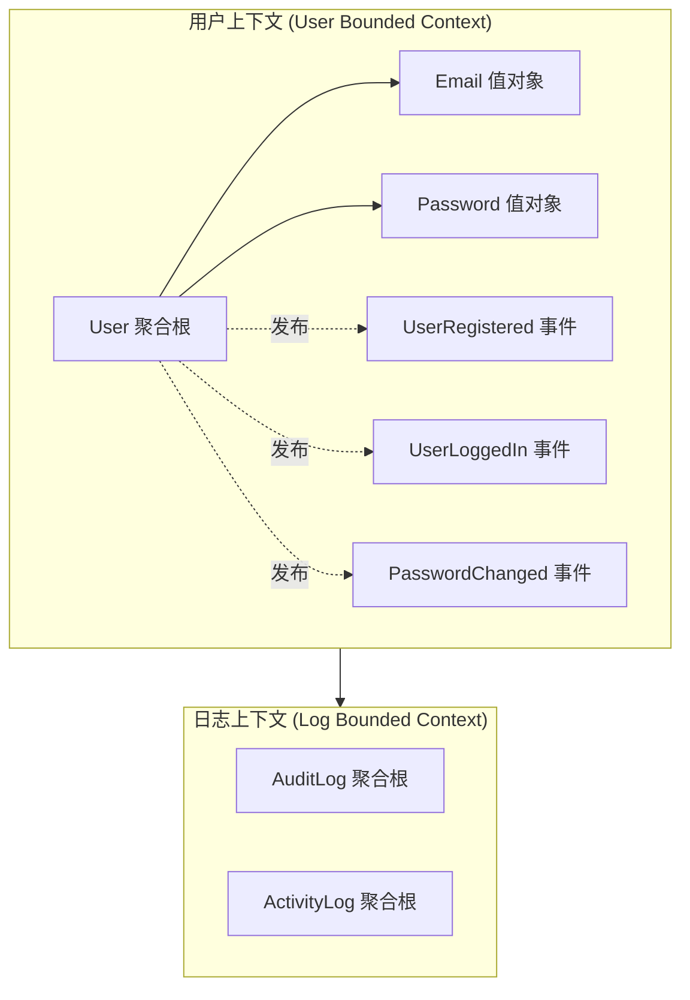

# 领域模型文档

本文档详细说明项目的领域模型设计，包括聚合根、实体、值对象和领域事件。

## 📋 目录

- [领域模型概览](#领域模型概览)
- [用户聚合（User Aggregate）](#用户聚合user-aggregate)
- [值对象设计](#值对象设计)
- [领域事件](#领域事件)
- [仓储接口](#仓储接口)
- [领域服务](#领域服务)
- [设计原则](#设计原则)

## 领域模型概览



**核心聚合**：
- **User** - 用户聚合根（认证、权限、资料）
- **AuditLog** - 审计日志聚合根（操作审计）
- **ActivityLog** - 活动日志聚合根（用户行为）

## 用户聚合（User Aggregate）

### 聚合根：User

**职责**：
- 管理用户身份和凭据
- 控制账户生命周期（创建、登录、锁定）
- 维护邮箱验证状态
- 跟踪登录尝试

**代码位置**：`internal/domain/user/entity.go`

#### 属性

| 属性 | 类型 | 说明 | 不变量 |
|------|------|------|--------|
| `ID` | string | 用户唯一标识（ULID） | 不可变 |
| `Email` | string | 用户邮箱 | 唯一，格式有效 |
| `Password` | string | 密码哈希（bcrypt） | 强度符合要求 |
| `EmailVerified` | bool | 邮箱验证状态 | - |
| `Locked` | bool | 账户锁定状态 | 失败≥5次自动锁定 |
| `FailedAttempts` | int | 连续失败次数 | 0-5 范围 |
| `LastLoginAt` | *time.Time | 最后登录时间 | 可为空 |
| `CreatedAt` | time.Time | 创建时间 | 不可变 |
| `UpdatedAt` | time.Time | 更新时间 | 自动更新 |

#### 工厂方法

```go
// NewUser 创建新用户
// 
// 不变量检查：
// 1. 邮箱格式必须有效
// 2. 密码强度必须符合要求（8-72字符，包含大小写和数字）
// 3. 密码自动加密（bcrypt）
func NewUser(email, password string) (*User, error) {
    // 验证邮箱
    if !isValidEmail(email) {
        return nil, ErrInvalidEmail
    }
    
    // 验证密码强度
    if len(password) < 8 || len(password) > 72 {
        return nil, ErrWeakPassword
    }
    
    // 加密密码
    hashedPassword, err := bcrypt.GenerateFromPassword(
        []byte(password), bcrypt.DefaultCost)
    if err != nil {
        return nil, err
    }
    
    now := time.Now()
    return &User{
        ID:             generateULID(),
        Email:          strings.ToLower(email),
        Password:       string(hashedPassword),
        EmailVerified:  false,
        Locked:         false,
        FailedAttempts: 0,
        CreatedAt:      now,
        UpdatedAt:      now,
    }, nil
}
```

#### 聚合行为

##### 1. 验证密码

```go
// VerifyPassword 验证密码是否匹配
func (u *User) VerifyPassword(password string) bool {
    err := bcrypt.CompareHashAndPassword(
        []byte(u.Password), []byte(password))
    return err == nil
}
```

**业务规则**：
- 使用 bcrypt 比较哈希
- 返回布尔值，不暴露具体错误

##### 2. 记录登录失败

```go
// RecordFailedLogin 记录登录失败
func (u *User) RecordFailedLogin() {
    u.FailedAttempts++
    
    // 失败 5 次自动锁定
    if u.FailedAttempts >= 5 {
        u.Locked = true
    }
    
    u.UpdatedAt = time.Now()
}
```

**业务规则**：
- 连续失败次数 +1
- 达到 5 次自动锁定账户
- 更新时间戳

##### 3. 重置登录失败

```go
// ResetFailedAttempts 重置登录失败计数
func (u *User) ResetFailedAttempts() {
    u.FailedAttempts = 0
    u.LastLoginAt = ptrTime(time.Now())
    u.UpdatedAt = time.Now()
}
```

**业务规则**：
- 登录成功后调用
- 重置失败计数为 0
- 记录最后登录时间

##### 4. 检查账户锁定

```go
// IsLocked 检查账户是否被锁定
func (u *User) IsLocked() bool {
    return u.Locked
}
```

**使用场景**：
- 登录前检查
- 阻止已锁定账户登录

##### 5. 更新密码

```go
// UpdatePassword 更新用户密码
func (u *User) UpdatePassword(newPassword string) error {
    // 验证新密码强度
    if len(newPassword) < 8 || len(newPassword) > 72 {
        return ErrWeakPassword
    }
    
    // 加密新密码
    hashedPassword, err := bcrypt.GenerateFromPassword(
        []byte(newPassword), bcrypt.DefaultCost)
    if err != nil {
        return err
    }
    
    u.Password = string(hashedPassword)
    u.UpdatedAt = time.Now()
    
    return nil
}
```

**业务规则**：
- 新密码必须符合强度要求
- 密码自动加密
- 更新时间戳

##### 6. 验证邮箱

```go
// VerifyEmail 标记邮箱已验证
func (u *User) VerifyEmail() {
    u.EmailVerified = true
    u.UpdatedAt = time.Now()
}
```

**使用场景**：
- 用户点击邮箱验证链接后调用

## 值对象设计

### 1. Email 值对象

**代码位置**：`internal/domain/user/value_objects.go`

```go
// Email 邮箱值对象
type Email struct {
    value string
}

// NewEmail 创建并验证邮箱值对象
func NewEmail(email string) (*Email, error) {
    // 验证邮箱格式
    if !isValidEmailFormat(email) {
        return nil, ErrInvalidEmailFormat
    }
    
    // 统一转为小写
    return &Email{
        value: strings.ToLower(email),
    }, nil
}

// String 返回邮箱字符串
func (e *Email) String() string {
    return e.value
}

// Equals 比较两个邮箱是否相同
func (e *Email) Equals(other *Email) bool {
    return e.value == other.value
}
```

**值对象特征**：
- ✅ 不可变（创建后不能修改）
- ✅ 通过值相等（而非引用）
- ✅ 自我验证（创建时验证格式）
- ✅ 无副作用

**使用示例**：
```go
email1, _ := NewEmail("User@Example.COM")
email2, _ := NewEmail("user@example.com")

fmt.Println(email1.Equals(email2)) // true（不区分大小写）
```

### 2. Password 值对象

```go
// Password 密码值对象
type Password struct {
    hashedValue string
}

// NewPassword 创建并验证密码强度
func NewPassword(plainPassword string) (*Password, error) {
    // 验证密码强度
    if err := validatePasswordStrength(plainPassword); err != nil {
        return nil, err
    }
    
    // 自动加密
    hashedValue, err := bcrypt.GenerateFromPassword(
        []byte(plainPassword), bcrypt.DefaultCost)
    if err != nil {
        return nil, err
    }
    
    return &Password{
        hashedValue: string(hashedValue),
    }, nil
}

// Matches 检查密码是否匹配
func (p *Password) Matches(plainPassword string) bool {
    err := bcrypt.CompareHashAndPassword(
        []byte(p.hashedValue), []byte(plainPassword))
    return err == nil
}

// Hash 返回密码哈希
func (p *Password) Hash() string {
    return p.hashedValue
}
```

**密码强度规则**：
```go
func validatePasswordStrength(password string) error {
    if len(password) < 8 {
        return ErrPasswordTooShort
    }
    if len(password) > 72 {
        return ErrPasswordTooLong
    }
    if !containsUppercase(password) {
        return ErrPasswordMissingUppercase
    }
    if !containsLowercase(password) {
        return ErrPasswordMissingLowercase
    }
    if !containsDigit(password) {
        return ErrPasswordMissingDigit
    }
    return nil
}
```

## 领域事件

### 事件接口定义

**代码位置**：`internal/domain/shared/events/domain_event.go`

```go
// DomainEvent 领域事件接口
type DomainEvent interface {
    EventName() string      // 事件名称（小写点分格式，如 "user.registered"）
    OccurredAt() time.Time  // 发生时间
}

// Handler 领域事件处理器
type Handler func(ctx context.Context, event DomainEvent) error

// Bus 进程内事件总线接口
type Bus interface {
    Publish(ctx context.Context, event DomainEvent) error   // 同步发布
    Subscribe(eventName string, handler Handler)            // 订阅事件
}
```

领域事件不自带 `AggregateID()` 方法（聚合根 ID 可作为事件字段存在），也不使用基类继承。每个事件结构体自行实现 `EventName()` 和 `OccurredAt()` 方法。

**实现示例**：
```go
var _ events.DomainEvent = (*UserRegistered)(nil)  // 编译期断言

type UserRegistered struct {
    UserID    string    `json:"user_id"`
    Email     string    `json:"email"`
    Timestamp time.Time `json:"timestamp"`
}

func (e *UserRegistered) EventName() string     { return "user.registered" }
func (e *UserRegistered) OccurredAt() time.Time { return e.Timestamp }
```

### 用户相关事件

**代码位置**：`internal/domain/user/events.go`

#### 1. UserRegistered（用户注册）

```go
type UserRegistered struct {
    UserID    string    `json:"user_id"`
    Email     string    `json:"email"`
    Timestamp time.Time `json:"timestamp"`
}

func NewUserRegisteredEvent(userID, email string) *UserRegistered {
    return &UserRegistered{
        UserID:    userID,
        Email:     email,
        Timestamp: time.Now(),
    }
}

func (e *UserRegistered) EventName() string     { return "user.registered" }
func (e *UserRegistered) OccurredAt() time.Time { return e.Timestamp }
```

**触发时机**：
- 用户成功注册账户

**监听器**：
- `AuditLogListener` - 记录审计日志
- `ActivityLogListener` - 记录活动日志
- `EmailListener` - 发送验证邮件（待实现）

#### 2. UserLoggedIn（用户登录）

```go
type UserLoggedIn struct {
    UserID    string    `json:"user_id"`
    Email     string    `json:"email"`
    IP        string    `json:"ip"`
    UserAgent string    `json:"user_agent"`
    Device    string    `json:"device"`
    Timestamp time.Time `json:"timestamp"`
}

func NewUserLoggedInEvent(userID, email, ip, userAgent, device string) *UserLoggedIn {
    return &UserLoggedIn{
        UserID:    userID,
        Email:     email,
        IP:        ip,
        UserAgent: userAgent,
        Device:    device,
        Timestamp: time.Now(),
    }
}

func (e *UserLoggedIn) EventName() string     { return "user.logged_in" }
func (e *UserLoggedIn) OccurredAt() time.Time { return e.Timestamp }
```

**触发时机**：
- 用户成功登录

**监听器**：
- `AuditLogListener` - 记录审计日志（状态 SUCCESS）
- `ActivityLogListener` - 记录登录活动
- `SecurityListener` - 检测异常登录（待实现）

#### 3. UserLoggedOut（用户登出）

```go
type UserLoggedOut struct {
    UserID    string    `json:"user_id"`
    Email     string    `json:"email"`
    Timestamp time.Time `json:"timestamp"`
}

func NewUserLoggedOutEvent(userID, email string) *UserLoggedOut {
    return &UserLoggedOut{
        UserID:    userID,
        Email:     email,
        Timestamp: time.Now(),
    }
}

func (e *UserLoggedOut) EventName() string     { return "user.logged_out" }
func (e *UserLoggedOut) OccurredAt() time.Time { return e.Timestamp }
```

**触发时机**：
- 用户主动登出
- Token 过期自动登出

#### 4. LoginFailed（登录失败）

```go
type LoginFailed struct {
    UserID    string    `json:"user_id"`
    Email     string    `json:"email"`
    IP        string    `json:"ip"`
    Reason    string    `json:"reason"`
    Timestamp time.Time `json:"timestamp"`
}

func NewLoginFailedEvent(userID, email, ip, reason string) *LoginFailed {
    return &LoginFailed{
        UserID:    userID,
        Email:     email,
        IP:        ip,
        Reason:    reason,
        Timestamp: time.Now(),
    }
}

func (e *LoginFailed) EventName() string     { return "user.login_failed" }
func (e *LoginFailed) OccurredAt() time.Time { return e.Timestamp }
```

**触发时机**：
- 密码错误
- 邮箱不存在
- 账户已锁定

#### 5. AccountLocked（账户锁定）

```go
type AccountLocked struct {
    UserID         string    `json:"user_id"`
    Email          string    `json:"email"`
    FailedAttempts int       `json:"failed_attempts"`
    LockedUntil    time.Time `json:"locked_until"`
    Timestamp      time.Time `json:"timestamp"`
}

func NewAccountLockedEvent(userID, email string, failedAttempts int, lockedUntil time.Time) *AccountLocked {
    return &AccountLocked{
        UserID:         userID,
        Email:          email,
        FailedAttempts: failedAttempts,
        LockedUntil:    lockedUntil,
        Timestamp:      time.Now(),
    }
}

func (e *AccountLocked) EventName() string     { return "user.account_locked" }
func (e *AccountLocked) OccurredAt() time.Time { return e.Timestamp }
```

**触发时机**：
- 连续 5 次登录失败自动锁定

**监听器**：
- `AuditLogListener` - 记录安全审计
- `EmailListener` - 发送锁定通知（待实现）

#### 6. TokenRefreshed（Token 刷新）

```go
type TokenRefreshed struct {
    UserID    string    `json:"user_id"`
    OldToken  string    `json:"old_token"`
    NewToken  string    `json:"new_token"`
    Timestamp time.Time `json:"timestamp"`
}

func NewTokenRefreshedEvent(userID, oldToken, newToken string) *TokenRefreshed {
    return &TokenRefreshed{
        UserID:    userID,
        OldToken:  oldToken,
        NewToken:  newToken,
        Timestamp: time.Now(),
    }
}

func (e *TokenRefreshed) EventName() string     { return "user.token_refreshed" }
func (e *TokenRefreshed) OccurredAt() time.Time { return e.Timestamp }
```

**触发时机**：
- 用户刷新 Access Token

#### 7. UserProfileUpdated（用户资料更新）

```go
type UserProfileUpdated struct {
    UserID    string    `json:"user_id"`
    Email     string    `json:"email"`
    Timestamp time.Time `json:"timestamp"`
}

func NewUserProfileUpdatedEvent(userID, email string) *UserProfileUpdated {
    return &UserProfileUpdated{
        UserID:    userID,
        Email:     email,
        Timestamp: time.Now(),
    }
}

func (e *UserProfileUpdated) EventName() string     { return "user.profile_updated" }
func (e *UserProfileUpdated) OccurredAt() time.Time { return e.Timestamp }
```

**触发时机**：
- 用户更新资料信息

### 事件常量（类型化）

**代码位置**：`pkg/constants/constants.go`

```go
type EventName string   // 领域事件名称类型
type QueueName string   // 消息队列名称类型

const (
    EventUserRegistered     EventName = "user.registered"
    EventUserLoggedIn       EventName = "user.logged_in"
    EventUserLoginFailed    EventName = "user.login_failed"
    EventUserAccountLocked  EventName = "user.account_locked"
    EventUserLoggedOut      EventName = "user.logged_out"
    EventUserTokenRefreshed EventName = "user.token_refreshed"
    EventUserProfileUpdated EventName = "user.profile_updated"
)
```

所有事件名常量使用 `EventName` 自定义类型，编译期拦截非法值传入。`DomainEvent.EventName()` 接口返回值保持 `string`（领域层不依赖基础设施包），转换在桥接层完成。

### 事件类型清单

| 事件常量 | 事件结构体 | 触发时机 | 监听器 |
|---------|-----------|---------|--------|
| `user.registered` | UserRegistered | 用户注册 | AuditLog, ActivityLog, Email |
| `user.logged_in` | UserLoggedIn | 用户登录 | AuditLog, ActivityLog, Security |
| `user.logged_out` | UserLoggedOut | 用户登出 | ActivityLog |
| `user.login_failed` | LoginFailed | 登录失败 | AuditLog |
| `user.account_locked` | AccountLocked | 账户锁定 | AuditLog, Email |
| `user.token_refreshed` | TokenRefreshed | Token 刷新 | ActivityLog |
| `user.profile_updated` | UserProfileUpdated | 资料更新 | AuditLog

## 仓储接口

**代码位置**：`internal/domain/user/repository.go`

```go
// UserRepository 用户仓储接口
// 
// 定义领域层需要的持久化操作
// 由基础设施层实现
type UserRepository interface {
    // FindByID 根据 ID 查找用户
    FindByID(ctx context.Context, id string) (*User, error)
    
    // FindByEmail 根据邮箱查找用户
    FindByEmail(ctx context.Context, email string) (*User, error)
    
    // Create 创建用户
    Create(ctx context.Context, user *User) error
    
    // Update 更新用户
    Update(ctx context.Context, user *User) error
    
    // Delete 删除用户
    Delete(ctx context.Context, id string) error
    
    // ExistsByEmail 检查邮箱是否已存在
    ExistsByEmail(ctx context.Context, email string) bool
}
```

**设计原则**：
- ✅ 接口定义在领域层
- ✅ 实现在基础设施层
- ✅ 返回领域对象（而非 DTO）
- ✅ 使用 context 控制生命周期

## 领域服务

### 何时使用领域服务

有些业务逻辑不属于单个聚合根，需要多个聚合协作，这时使用领域服务：

```go
// TransferService 转账领域服务
type TransferService struct {
    accountRepo AccountRepository
}

// Transfer 转账（涉及两个账户聚合）
func (s *TransferService) Transfer(ctx context.Context, fromID, toID string, amount Money) error {
    fromAccount, err := s.accountRepo.FindByID(ctx, fromID)
    if err != nil {
        return err
    }
    
    toAccount, err := s.accountRepo.FindByID(ctx, toID)
    if err != nil {
        return err
    }
    
    // 从一个账户扣款
    if err := fromAccount.Withdraw(amount); err != nil {
        return err
    }
    
    // 向另一个账户存款
    toAccount.Deposit(amount)
    
    // 持久化
    if err := s.accountRepo.Update(ctx, fromAccount); err != nil {
        return err
    }
    
    return s.accountRepo.Update(ctx, toAccount)
}
```

**领域服务特征**：
- ❌ 不是实体或值对象的方法
- ✅ 操作涉及多个聚合
- ✅ 无状态（不保存数据）
- ✅ 使用领域对象作为参数和返回值

## 设计原则

### 1. 聚合边界

**规则**：
- ✅ 聚合内强一致性
- ✅ 聚合间最终一致性（通过事件）
- ✅ 聚合根是访问入口
- ❌ 外部不能直接引用聚合内实体

**示例**：
```
User（聚合根）
├── EmailVerified（属性）
├── FailedAttempts（属性）
└── [内部状态]
    ├── 登录失败计数
    └── 锁定状态

外部只能通过 User 聚合根访问和修改
```

### 2. 不变量（Invariants）

**定义**：聚合必须始终保持的业务规则。

**User 聚合的不变量**：
1. 邮箱格式必须有效
2. 密码必须是 bcrypt 哈希
3. 失败次数不能超过 5 次（超过则锁定）
4. ID 和创建时间不可变

**代码实现**：
```go
// 通过工厂方法和聚合行为维护不变量
func NewUser(email, password string) (*User, error) {
    // 检查不变量 1: 邮箱格式
    if !isValidEmail(email) {
        return nil, ErrInvalidEmail
    }
    
    // 检查不变量 2: 密码强度
    if !isStrongPassword(password) {
        return nil, ErrWeakPassword
    }
    
    // 维护不变量：自动加密密码
    hashedPassword := bcrypt(password)
    
    return &User{...}, nil
}
```

### 3. 富领域模型

**反模式（贫血模型）**：
```go
// ❌ 只有数据，没有行为
type User struct {
    ID       string
    Email    string
    Password string
}

// 业务逻辑散落在 Service 层
func (s *Service) ChangePassword(userID, newPassword string) error {
    user := s.repo.FindByID(userID)
    
    // Service 层负责验证（不好）
    if len(newPassword) < 8 {
        return ErrWeakPassword
    }
    
    user.Password = bcrypt(newPassword)
    return s.repo.Update(user)
}
```

**正确做法（富领域模型）**：
```go
// ✅ 聚合根包含业务逻辑
type User struct {
    ID       string
    Email    string
    Password string
}

// 聚合根负责维护自己的状态
func (u *User) UpdatePassword(newPassword string) error {
    // 聚合根自己验证（好）
    if len(newPassword) < 8 {
        return ErrWeakPassword
    }
    
    u.Password = bcrypt(newPassword)
    return nil
}

// Service 层只负责编排
func (s *Service) ChangePassword(userID, newPassword string) error {
    user := s.repo.FindByID(userID)
    
    // 调用聚合根行为
    if err := user.UpdatePassword(newPassword); err != nil {
        return err
    }
    
    return s.repo.Update(user)
}
```

### 4. 值对象优先

**优先使用值对象而非基本类型**：

```go
// ❌ 使用基本类型
type User struct {
    Email    string  // 可能是无效格式
    Password string  // 可能是明文
}

// ✅ 使用值对象
type User struct {
    Email    *Email     // 保证格式有效
    Password *Password  // 保证已加密
}
```

**值对象优势**：
- ✅ 自我验证（创建时检查）
- ✅ 类型安全（编译期检查）
- ✅ 不可变（线程安全）
- ✅ 表达力强（业务语义清晰）

## 📚 延伸阅读

- [DDD 架构设计](DDD_ARCHITECTURE.md) - 架构分层和依赖规则
- [事件风暴文档](EVENT_STORMING.md) - 领域事件设计过程
- [数据库设计](../database/SCHEMA_DESIGN.md) - 聚合到表的映射
