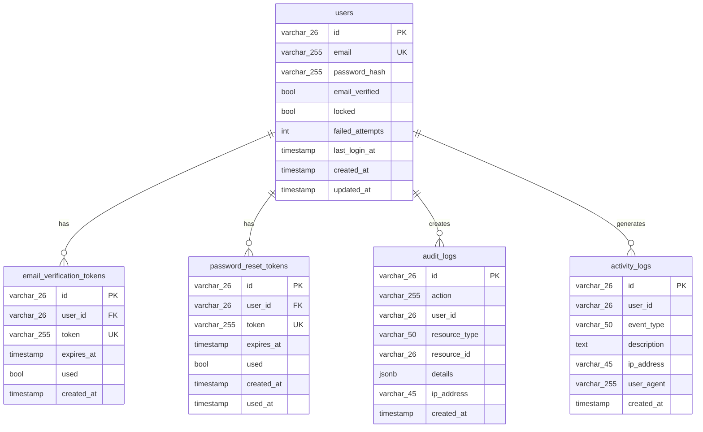

# 数据库设计文档

本文档详细说明项目的数据库设计，包括表结构、索引策略和 ER 图。

## 📋 目录

- [数据库概览](#数据库概览)
- [ER 图](#er-图)
- [表结构](#表结构)
- [索引策略](#索引策略)
- [迁移管理](#迁移管理)
- [性能优化](#性能优化)

## 数据库概览

**数据库**：PostgreSQL 14+

**核心表**：
| 表名 | 说明 | 聚合映射 | 记录数预估 |
|------|------|---------|-----------|
| `users` | 用户表 | User 聚合根 | 10 万+ |
| `email_verification_tokens` | 邮箱验证令牌表 | - | 低（临时数据） |
| `password_reset_tokens` | 密码重置令牌表 | - | 低（临时数据） |
| `audit_logs` | 审计日志表 | AuditLog 聚合根 | 100 万+ |
| `activity_logs` | 活动日志表 | ActivityLog 聚合根 | 500 万+ |

## ER 图



## 表结构

### 1. users（用户表）

**功能**：存储用户账户信息

**DDL**：
```sql
CREATE TABLE users (
    id VARCHAR(26) PRIMARY KEY,              -- ULID 主键
    email VARCHAR(255) NOT NULL UNIQUE,      -- 邮箱（唯一）
    password_hash VARCHAR(255) NOT NULL,     -- 密码哈希（bcrypt）
    email_verified BOOLEAN DEFAULT FALSE,    -- 邮箱验证状态
    locked BOOLEAN DEFAULT FALSE,            -- 账户锁定状态
    failed_attempts INTEGER DEFAULT 0,       -- 连续登录失败次数
    last_login_at TIMESTAMP,                 -- 最后登录时间
    created_at TIMESTAMP DEFAULT NOW(),      -- 创建时间
    updated_at TIMESTAMP DEFAULT NOW()       -- 更新时间
);

-- 索引
CREATE UNIQUE INDEX idx_users_email ON users(email);
CREATE INDEX idx_users_created_at ON users(created_at DESC);
```

**字段说明**：
| 字段 | 类型 | 约束 | 说明 |
|------|------|------|------|
| `id` | VARCHAR(26) | PK | ULID 格式，按时间排序 |
| `email` | VARCHAR(255) | UNIQUE, NOT NULL | 统一小写存储 |
| `password_hash` | VARCHAR(255) | NOT NULL | bcrypt 哈希（cost=10） |
| `email_verified` | BOOLEAN | DEFAULT FALSE | 邮箱验证后设为 TRUE |
| `locked` | BOOLEAN | DEFAULT FALSE | 失败 5 次自动锁定 |
| `failed_attempts` | INTEGER | DEFAULT 0 | 登录成功后重置 |
| `last_login_at` | TIMESTAMP | NULLABLE | 首次登录前为 NULL |
| `created_at` | TIMESTAMP | AUTO | 记录创建时间 |
| `updated_at` | TIMESTAMP | AUTO | 记录更新时间 |

**业务规则**：
- 邮箱唯一性约束
- 密码必须 bcrypt 加密
- `failed_attempts` 达到 5 时自动设置 `locked=TRUE`

### 2. email_verification_tokens（邮箱验证令牌表）

**功能**：存储邮箱验证临时令牌

**DDL**：
```sql
CREATE TABLE email_verification_tokens (
    id VARCHAR(26) PRIMARY KEY,              -- ULID 主键
    user_id VARCHAR(26) NOT NULL REFERENCES users(id) ON DELETE CASCADE,
    token VARCHAR(255) NOT NULL UNIQUE,      -- 验证令牌（SHA256）
    expires_at TIMESTAMP NOT NULL,           -- 过期时间
    used BOOLEAN DEFAULT FALSE,              -- 是否已使用
    created_at TIMESTAMP DEFAULT NOW()
);

-- 索引
CREATE INDEX idx_email_tokens_user_id ON email_verification_tokens(user_id);
CREATE INDEX idx_email_tokens_token ON email_verification_tokens(token);
CREATE INDEX idx_email_tokens_expires_at ON email_verification_tokens(expires_at);
```

**字段说明**：
| 字段 | 类型 | 约束 | 说明 |
|------|------|------|------|
| `id` | VARCHAR(26) | PK | ULID 主键 |
| `user_id` | VARCHAR(26) | FK → users | 关联用户 |
| `token` | VARCHAR(255) | UNIQUE | 随机令牌（URL-safe） |
| `expires_at` | TIMESTAMP | NOT NULL | 24 小时后过期 |
| `used` | BOOLEAN | DEFAULT FALSE | 使用后标记 |

**生命周期**：
1. 用户注册时创建令牌
2. 发送邮件包含验证链接（含 token）
3. 用户点击链接，验证 token
4. 标记 `used=TRUE` 或删除记录

### 3. password_reset_tokens（密码重置令牌表）

**功能**：存储密码重置临时令牌

**DDL**：
```sql
CREATE TABLE password_reset_tokens (
    id VARCHAR(26) PRIMARY KEY,
    user_id VARCHAR(26) NOT NULL REFERENCES users(id) ON DELETE CASCADE,
    token VARCHAR(255) NOT NULL UNIQUE,
    expires_at TIMESTAMP NOT NULL,           -- 过期时间（1小时）
    used BOOLEAN DEFAULT FALSE,
    created_at TIMESTAMP DEFAULT NOW(),
    used_at TIMESTAMP                        -- 使用时间
);

-- 索引
CREATE INDEX idx_reset_tokens_user_id ON password_reset_tokens(user_id);
CREATE INDEX idx_reset_tokens_token ON password_reset_tokens(token);
```

**字段说明**：
| 字段 | 类型 | 约束 | 说明 |
|------|------|------|------|
| `expires_at` | TIMESTAMP | NOT NULL | 1 小时后过期 |
| `used_at` | TIMESTAMP | NULLABLE | 记录使用时间 |

**安全特性**：
- 令牌只能使用一次
- 1 小时后自动过期
- 使用后记录 `used_at` 时间戳

### 4. audit_logs（审计日志表）

**功能**：记录关键操作审计（安全合规）

**DDL**：
```sql
CREATE TABLE audit_logs (
    id VARCHAR(26) PRIMARY KEY,
    action VARCHAR(255) NOT NULL,            -- 操作类型
    user_id VARCHAR(26),                     -- 操作者（可为空）
    resource_type VARCHAR(50),               -- 资源类型
    resource_id VARCHAR(26),                 -- 资源 ID
    details JSONB,                           -- 详细信息
    ip_address VARCHAR(45),                  -- IP 地址
    created_at TIMESTAMP DEFAULT NOW()
);

-- 索引
CREATE INDEX idx_audit_logs_user_id ON audit_logs(user_id);
CREATE INDEX idx_audit_logs_action ON audit_logs(action);
CREATE INDEX idx_audit_logs_created_at ON audit_logs(created_at DESC);
CREATE INDEX idx_audit_logs_resource ON audit_logs(resource_type, resource_id);
```

**字段说明**：
| 字段 | 类型 | 约束 | 说明 |
|------|------|------|------|
| `action` | VARCHAR(255) | NOT NULL | 如 `user.registered`, `user.login` |
| `user_id` | VARCHAR(26) | NULLABLE | 匿名用户时为 NULL |
| `resource_type` | VARCHAR(50) | - | 如 `user`, `order` |
| `resource_id` | VARCHAR(26) | - | 资源标识 |
| `details` | JSONB | - | 操作详情（JSON 格式） |
| `ip_address` | VARCHAR(45) | - | IPv4 或 IPv6 |

**审计场景**：
- 用户注册/登录/登出
- 密码修改/重置
- 权限变更
- 数据删除

**JSONB 示例**：
```json
{
  "email": "user@example.com",
  "old_role": "user",
  "new_role": "admin",
  "changed_by": "admin-001"
}
```

### 5. activity_logs（活动日志表）

**功能**：记录用户行为（分析用户活跃度）

**DDL**：
```sql
CREATE TABLE activity_logs (
    id VARCHAR(26) PRIMARY KEY,
    user_id VARCHAR(26) NOT NULL,
    event_type VARCHAR(50) NOT NULL,         -- 事件类型
    description TEXT,                        -- 描述
    ip_address VARCHAR(45),                  -- IP 地址
    user_agent VARCHAR(255),                 -- 浏览器 UA
    created_at TIMESTAMP DEFAULT NOW()
);

-- 索引
CREATE INDEX idx_activity_logs_user_id ON activity_logs(user_id);
CREATE INDEX idx_activity_logs_event_type ON activity_logs(event_type);
CREATE INDEX idx_activity_logs_created_at ON activity_logs(created_at DESC);
CREATE INDEX idx_activity_logs_user_time ON activity_logs(user_id, created_at DESC);
```

**字段说明**：
| 字段 | 类型 | 约束 | 说明 |
|------|------|------|------|
| `event_type` | VARCHAR(50) | NOT NULL | 如 `login`, `page_view` |
| `description` | TEXT | - | 人类可读描述 |
| `user_agent` | VARCHAR(255) | - | 客户端浏览器信息 |

**活动场景**：
- 用户登录/登出
- 页面访问
- 功能使用
- 数据导出

## 索引策略

### 索引类型

| 索引类型 | 使用场景 | 示例 |
|---------|---------|------|
| **主键索引** | 唯一标识 | `users.id` |
| **唯一索引** | 唯一约束 | `users.email` |
| **普通索引** | 频繁查询 | `audit_logs.user_id` |
| **复合索引** | 多字段查询 | `activity_logs(user_id, created_at)` |
| **部分索引** | 条件查询 | `WHERE used = FALSE` |

### 关键索引

```sql
-- 1. 用户邮箱唯一索引（登录查询）
CREATE UNIQUE INDEX idx_users_email ON users(email);

-- 2. 用户创建时间倒序索引（列表分页）
CREATE INDEX idx_users_created_at ON users(created_at DESC);

-- 3. 审计日志复合索引（按用户和时间查询）
CREATE INDEX idx_audit_logs_user_time ON audit_logs(user_id, created_at DESC);

-- 4. 活动日志用户时间索引（用户活动轨迹）
CREATE INDEX idx_activity_logs_user_time ON activity_logs(user_id, created_at DESC);

-- 5. 令牌表部分索引（仅索引未使用的令牌）
CREATE INDEX idx_email_tokens_unused ON email_verification_tokens(user_id) 
WHERE used = FALSE;
```

### 索引使用建议

✅ **应该创建索引**：
- WHERE 条件字段
- JOIN 字段
- ORDER BY 字段
- 唯一约束字段

❌ **不应创建索引**：
- 低基数字段（如 `locked`、`email_verified`）
- 频繁更新的字段
- 小表（< 1000 行）

## 迁移管理

### 迁移文件组织

```
migrations/
├── 001_create_users_table.up.sql
├── 001_create_users_table.down.sql
├── 003_create_email_verification_tokens_table.up.sql
├── 003_create_email_verification_tokens_table.down.sql
├── 004_create_password_reset_tokens_table.up.sql
├── 004_create_password_reset_tokens_table.down.sql
├── 005_create_audit_logs_table.up.sql
├── 005_create_audit_logs_table.down.sql
├── 006_create_activity_logs_table.up.sql
└── 006_create_activity_logs_table.down.sql
```

### 编写迁移脚本

**正向迁移**（`.up.sql`）：
```sql
-- 001_create_users_table.up.sql
CREATE TABLE IF NOT EXISTS users (
    id VARCHAR(26) PRIMARY KEY,
    email VARCHAR(255) NOT NULL UNIQUE,
    password_hash VARCHAR(255) NOT NULL,
    email_verified BOOLEAN DEFAULT FALSE,
    locked BOOLEAN DEFAULT FALSE,
    failed_attempts INTEGER DEFAULT 0,
    last_login_at TIMESTAMP,
    created_at TIMESTAMP DEFAULT NOW(),
    updated_at TIMESTAMP DEFAULT NOW()
);

CREATE INDEX idx_users_created_at ON users(created_at DESC);
```

**回滚迁移**（`.down.sql`）：
```sql
-- 001_create_users_table.down.sql
DROP TABLE IF EXISTS users CASCADE;
```

### 执行迁移

```bash
# 执行所有迁移
make migrate up

# 回滚最后一步
make migrate down

# 查看迁移状态
make db-status
```

**迁移状态示例**：
```
version: 6/6, name: create_activity_logs_table
Applied At                  | Migration
======================================
2026-04-08 10:00:00         | 001_create_users_table
2026-04-08 10:00:01         | 003_create_email_verification_tokens_table
2026-04-08 10:00:02         | 004_create_password_reset_tokens_table
2026-04-08 10:00:03         | 005_create_audit_logs_table
2026-04-08 10:00:04         | 006_create_activity_logs_table
```

## 性能优化

### 1. 查询优化

**慢查询示例**：
```sql
-- ❌ 全表扫描
SELECT * FROM users WHERE LOWER(email) = 'user@example.com';
```

**优化方案**：
```sql
-- ✅ 使用索引（存储时已转小写）
SELECT * FROM users WHERE email = 'user@example.com';
```

### 2. 分页优化

**OFFSET 分页（数据量大时慢）**：
```sql
-- ❌ 偏移量大时性能差
SELECT * FROM users ORDER BY created_at DESC LIMIT 20 OFFSET 100000;
```

**游标分页（推荐）**：
```sql
-- ✅ 使用上次查询的最后一条记录 ID
SELECT * FROM users 
WHERE created_at < '2026-04-08 10:00:00'
ORDER BY created_at DESC 
LIMIT 20;
```

### 3. 索引监控

**检查未使用的索引**：
```sql
SELECT 
    schemaname,
    tablename,
    indexname,
    idx_scan,
    idx_tup_read,
    idx_tup_fetch
FROM pg_stat_user_indexes
WHERE idx_scan = 0
ORDER BY tablename, indexname;
```

**检查慢查询**：
```sql
SELECT 
    query,
    calls,
    total_time,
    mean_time,
    rows
FROM pg_stat_statements
ORDER BY mean_time DESC
LIMIT 10;
```

### 4. 表分区（大数据量）

**活动日志按月分区**：
```sql
-- 创建分区表
CREATE TABLE activity_logs (
    id VARCHAR(26),
    user_id VARCHAR(26) NOT NULL,
    event_type VARCHAR(50) NOT NULL,
    description TEXT,
    ip_address VARCHAR(45),
    user_agent VARCHAR(255),
    created_at TIMESTAMP DEFAULT NOW()
) PARTITION BY RANGE (created_at);

-- 创建分区
CREATE TABLE activity_logs_2026_04 PARTITION OF activity_logs
    FOR VALUES FROM ('2026-04-01') TO ('2026-05-01');

CREATE TABLE activity_logs_2026_05 PARTITION OF activity_logs
    FOR VALUES FROM ('2026-05-01') TO ('2026-06-01');
```

**优势**：
- 查询只扫描相关分区
- 可删除旧分区清理数据
- 索引更小，性能更好

### 5. 连接池配置

**推荐配置**（根据服务器配置调整）：
```go
// internal/infra/persistence/db.go
sqlDB.SetMaxOpenConns(25)     // 最大连接数
sqlDB.SetMaxIdleConns(10)     // 空闲连接数
sqlDB.SetConnMaxLifetime(5 * time.Minute)  // 连接最大存活时间
```

**监控连接池**：
```go
stats := sqlDB.Stats()
fmt.Printf("OpenConnections: %d\n", stats.OpenConnections)
fmt.Printf("InUse: %d\n", stats.InUse)
fmt.Printf("Idle: %d\n", stats.Idle)
```

## 📚 延伸阅读

- [迁移指南](MIGRATION_GUIDE.md) - 数据库版本管理
- [领域模型](../architecture/DOMAIN_MODEL.md) - 聚合到表的映射
- [性能调优](../operations/PERFORMANCE_TUNING.md) - 数据库性能优化
