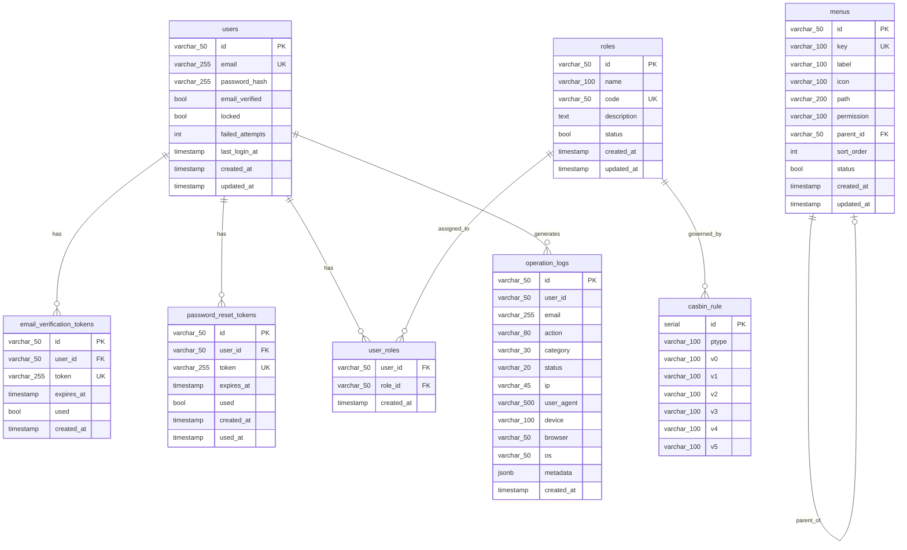

# 数据库设计文档

本文档详细说明项目的数据库设计，包括表结构、索引策略和 ER 图。

## 📋 目录

- [数据库概览](#数据库概览)
- [ER 图](#er-图)
- [表结构](#表结构)
- [索引策略](#索引策略)
- [迁移管理](#迁移管理)
- [性能优化](#性能优化)

## 数据库概览

**数据库**：PostgreSQL 14+

**核心表**：
| 表名 | 说明 | 聚合映射 | 记录数预估 |
|------|------|---------|----------|
| `users` | 用户表 | User 聚合根 | 10 万+ |
| `email_verification_tokens` | 邮箱验证令牌表 | - | 低（临时数据） |
| `password_reset_tokens` | 密码重置令牌表 | - | 低（临时数据） |
| `roles` | 角色表 | Role 聚合根 | 少 |
| `user_roles` | 用户角色关联表 | - | 10 万+ |
| `casbin_rule` | Casbin 策略规则表 | - | 少 |
| `menus` | 菜单管理表 | Menu 实体 | 少 |
| `operation_logs` | 统一操作日志表 | OperationLog 聚合根 | 500 万+ |

## ER 图



## 表结构

### 1. users（用户表）

**功能**：存储用户账户信息

**DDL**：
```sql
CREATE TABLE users (
    id VARCHAR(26) PRIMARY KEY,              -- ULID 主键
    email VARCHAR(255) NOT NULL UNIQUE,      -- 邮箱（唯一）
    password_hash VARCHAR(255) NOT NULL,     -- 密码哈希（bcrypt）
    email_verified BOOLEAN DEFAULT FALSE,    -- 邮箱验证状态
    locked BOOLEAN DEFAULT FALSE,            -- 账户锁定状态
    failed_attempts INTEGER DEFAULT 0,       -- 连续登录失败次数
    last_login_at TIMESTAMP,                 -- 最后登录时间
    created_at TIMESTAMP DEFAULT NOW(),      -- 创建时间
    updated_at TIMESTAMP DEFAULT NOW()       -- 更新时间
);

-- 索引
CREATE UNIQUE INDEX idx_users_email ON users(email);
CREATE INDEX idx_users_created_at ON users(created_at DESC);
```

**字段说明**：
| 字段 | 类型 | 约束 | 说明 |
|------|------|------|------|
| `id` | VARCHAR(26) | PK | ULID 格式，按时间排序 |
| `email` | VARCHAR(255) | UNIQUE, NOT NULL | 统一小写存储 |
| `password_hash` | VARCHAR(255) | NOT NULL | bcrypt 哈希（cost=10） |
| `email_verified` | BOOLEAN | DEFAULT FALSE | 邮箱验证后设为 TRUE |
| `locked` | BOOLEAN | DEFAULT FALSE | 失败 5 次自动锁定 |
| `failed_attempts` | INTEGER | DEFAULT 0 | 登录成功后重置 |
| `last_login_at` | TIMESTAMP | NULLABLE | 首次登录前为 NULL |
| `created_at` | TIMESTAMP | AUTO | 记录创建时间 |
| `updated_at` | TIMESTAMP | AUTO | 记录更新时间 |

**业务规则**：
- 邮箱唯一性约束
- 密码必须 bcrypt 加密
- `failed_attempts` 达到 5 时自动设置 `locked=TRUE`

### 2. email_verification_tokens（邮箱验证令牌表）

**功能**：存储邮箱验证临时令牌

**DDL**：
```sql
CREATE TABLE email_verification_tokens (
    id VARCHAR(26) PRIMARY KEY,              -- ULID 主键
    user_id VARCHAR(26) NOT NULL REFERENCES users(id) ON DELETE CASCADE,
    token VARCHAR(255) NOT NULL UNIQUE,      -- 验证令牌（SHA256）
    expires_at TIMESTAMP NOT NULL,           -- 过期时间
    used BOOLEAN DEFAULT FALSE,              -- 是否已使用
    created_at TIMESTAMP DEFAULT NOW()
);

-- 索引
CREATE INDEX idx_email_tokens_user_id ON email_verification_tokens(user_id);
CREATE INDEX idx_email_tokens_token ON email_verification_tokens(token);
CREATE INDEX idx_email_tokens_expires_at ON email_verification_tokens(expires_at);
```

**字段说明**：
| 字段 | 类型 | 约束 | 说明 |
|------|------|------|------|
| `id` | VARCHAR(26) | PK | ULID 主键 |
| `user_id` | VARCHAR(26) | FK → users | 关联用户 |
| `token` | VARCHAR(255) | UNIQUE | 随机令牌（URL-safe） |
| `expires_at` | TIMESTAMP | NOT NULL | 24 小时后过期 |
| `used` | BOOLEAN | DEFAULT FALSE | 使用后标记 |

**生命周期**：
1. 用户注册时创建令牌
2. 发送邮件包含验证链接（含 token）
3. 用户点击链接，验证 token
4. 标记 `used=TRUE` 或删除记录

### 3. password_reset_tokens（密码重置令牌表）

**功能**：存储密码重置临时令牌

**DDL**：
```sql
CREATE TABLE password_reset_tokens (
    id VARCHAR(26) PRIMARY KEY,
    user_id VARCHAR(26) NOT NULL REFERENCES users(id) ON DELETE CASCADE,
    token VARCHAR(255) NOT NULL UNIQUE,
    expires_at TIMESTAMP NOT NULL,           -- 过期时间（1小时）
    used BOOLEAN DEFAULT FALSE,
    created_at TIMESTAMP DEFAULT NOW(),
    used_at TIMESTAMP                        -- 使用时间
);

-- 索引
CREATE INDEX idx_reset_tokens_user_id ON password_reset_tokens(user_id);
CREATE INDEX idx_reset_tokens_token ON password_reset_tokens(token);
```

**字段说明**：
| 字段 | 类型 | 约束 | 说明 |
|------|------|------|------|
| `expires_at` | TIMESTAMP | NOT NULL | 1 小时后过期 |
| `used_at` | TIMESTAMP | NULLABLE | 记录使用时间 |

**安全特性**：
- 令牌只能使用一次
- 1 小时后自动过期
- 使用后记录 `used_at` 时间戳

### 4. roles（角色表）

**功能**：定义系统角色（RBAC 模型）

**DDL**：
```sql
CREATE TABLE roles (
    id VARCHAR(50) PRIMARY KEY,
    name VARCHAR(100) NOT NULL,
    code VARCHAR(50) UNIQUE NOT NULL,
    description TEXT DEFAULT '',
    status BOOLEAN DEFAULT TRUE,
    created_at TIMESTAMP WITH TIME ZONE NOT NULL DEFAULT CURRENT_TIMESTAMP,
    updated_at TIMESTAMP WITH TIME ZONE NOT NULL DEFAULT CURRENT_TIMESTAMP
);
```

**字段说明**：
| 字段 | 类型 | 约束 | 说明 |
|------|------|------|------|
| `id` | VARCHAR(50) | PK | ULID 格式 |
| `name` | VARCHAR(100) | NOT NULL | 角色名称，如“创始人”“管理员” |
| `code` | VARCHAR(50) | UNIQUE | 角色编码，如 `FOUNDER`、`ADMIN` |
| `description` | TEXT | - | 角色描述 |
| `status` | BOOLEAN | DEFAULT TRUE | 是否启用 |

### 5. user_roles（用户角色关联表）

**功能**：用户与角色的多对多关联

**DDL**：
```sql
CREATE TABLE user_roles (
    user_id VARCHAR(50) NOT NULL REFERENCES users(id) ON DELETE CASCADE,
    role_id VARCHAR(50) NOT NULL REFERENCES roles(id) ON DELETE CASCADE,
    created_at TIMESTAMP WITH TIME ZONE NOT NULL DEFAULT CURRENT_TIMESTAMP,
    PRIMARY KEY (user_id, role_id)
);
```

### 6. casbin_rule（Casbin 策略规则表）

**功能**：存储 Casbin 权限引擎的策略规则

**DDL**：
```sql
CREATE TABLE casbin_rule (
    id    SERIAL PRIMARY KEY,
    ptype VARCHAR(100) NOT NULL,
    v0    VARCHAR(100) NOT NULL DEFAULT '',
    v1    VARCHAR(100) NOT NULL DEFAULT '',
    v2    VARCHAR(100) NOT NULL DEFAULT '',
    v3    VARCHAR(100) NOT NULL DEFAULT '',
    v4    VARCHAR(100) NOT NULL DEFAULT '',
    v5    VARCHAR(100) NOT NULL DEFAULT ''
);

CREATE INDEX idx_casbin_rule_ptype ON casbin_rule(ptype);
```

**策略模型说明**：
| ptype | v0 | v1 | v2 | 说明 |
|-------|----|----|----|----- |
| `p` | role_code | path | method | 权限策略：角色对资源的访问权限 |
| `g` | user_id | role_code | - | 角色分配：用户与角色的关联 |

**示例**：
```
p, FOUNDER, /api/v1/*, *,         -- 创始人拥有所有权限
p, ADMIN, /api/v1/users, GET,     -- 管理员可查看用户
g, user-001, FOUNDER,             -- user-001 拥有创始人角色
```

### 7. menus（菜单管理表）

**功能**：管理后台菜单配置，支持树形结构，驱动前端侧边栏动态渲染

**DDL**：
```sql
CREATE TABLE menus (
    id VARCHAR(50) PRIMARY KEY,
    key VARCHAR(100) UNIQUE NOT NULL,
    label VARCHAR(100) NOT NULL,
    icon VARCHAR(100) DEFAULT '',
    path VARCHAR(200) DEFAULT '',
    permission VARCHAR(100) DEFAULT '',
    parent_id VARCHAR(50) REFERENCES menus(id) ON DELETE CASCADE,
    sort_order INTEGER NOT NULL DEFAULT 0,
    status BOOLEAN NOT NULL DEFAULT TRUE,
    created_at TIMESTAMP WITH TIME ZONE NOT NULL DEFAULT CURRENT_TIMESTAMP,
    updated_at TIMESTAMP WITH TIME ZONE NOT NULL DEFAULT CURRENT_TIMESTAMP
);
```

**字段说明**：
| 字段 | 类型 | 约束 | 说明 |
|------|------|------|------|
| `id` | VARCHAR(50) | PK | ULID 格式 |
| `key` | VARCHAR(100) | UNIQUE | 菜单唯一标识 |
| `label` | VARCHAR(100) | NOT NULL | 菜单显示名称 |
| `icon` | VARCHAR(100) | - | Ant Design 图标名称（如 `DashboardOutlined`） |
| `path` | VARCHAR(200) | - | 前端路由路径 |
| `permission` | VARCHAR(100) | - | 权限标识（如 `user:manage`） |
| `parent_id` | VARCHAR(50) | FK → menus | 父菜单 ID，NULL 表示顶级 |
| `sort_order` | INTEGER | DEFAULT 0 | 排序序号，升序 |
| `status` | BOOLEAN | DEFAULT TRUE | 是否启用 |

### 8. operation_logs（统一操作日志表）

**功能**：统一记录安全审计事件与业务操作事件（合并原 audit_logs 与 activity_logs）

**DDL**：
```sql
CREATE TABLE operation_logs (
    id          VARCHAR(50) PRIMARY KEY,
    user_id     VARCHAR(50) NOT NULL,
    email       VARCHAR(255),
    action      VARCHAR(80) NOT NULL,
    category    VARCHAR(30) NOT NULL,
    status      VARCHAR(20) NOT NULL DEFAULT 'SUCCESS',
    ip          VARCHAR(45),
    user_agent  VARCHAR(500),
    device      VARCHAR(100),
    browser     VARCHAR(50),
    os          VARCHAR(50),
    metadata    JSONB DEFAULT '{}'::jsonb,
    created_at  TIMESTAMP WITH TIME ZONE NOT NULL DEFAULT CURRENT_TIMESTAMP
);

-- 索引
CREATE INDEX idx_operation_logs_user_created ON operation_logs(user_id, created_at DESC);
CREATE INDEX idx_operation_logs_category_created ON operation_logs(category, created_at DESC);
CREATE INDEX idx_operation_logs_action ON operation_logs(action);
CREATE INDEX idx_operation_logs_action_created ON operation_logs(action, created_at DESC);
CREATE INDEX idx_operation_logs_status ON operation_logs(status);
CREATE INDEX idx_operation_logs_failed ON operation_logs(status, created_at DESC) WHERE status = 'FAILED';
```

**字段说明**：
| 字段 | 类型 | 约束 | 说明 |
|------|------|------|------|
| `action` | VARCHAR(80) | NOT NULL | 操作类型，如 `AUTH.LOGIN.SUCCESS`、`USER.PROFILE.UPDATED` |
| `category` | VARCHAR(30) | NOT NULL | 操作分类：`AUTH` / `USER` / `SYSTEM` / `BIZ` |
| `status` | VARCHAR(20) | DEFAULT SUCCESS | 操作状态：`SUCCESS` / `FAILED` |
| `metadata` | JSONB | - | 事件元数据（灵活存储） |
| `device` | VARCHAR(100) | - | 设备类型（mobile/tablet/desktop） |

**action 命名规范**：`{Category}.{Resource}.{Action}.{Result}`

| 示例 action | 说明 |
|------------|------|
| `AUTH.LOGIN.SUCCESS` | 登录成功 |
| `AUTH.LOGIN.FAILED` | 登录失败 |
| `USER.PROFILE.UPDATED` | 用户资料更新 |
| `USER.PASSWORD.RESET` | 密码重置 |
| `SYSTEM.MENU.CREATED` | 菜单创建 |
| `BIZ.GOAL.COMPLETED` | 目标达成 |

**JSONB 示例**：
```json
{
  "email": "user@example.com",
  "old_role": "user",
  "new_role": "admin",
  "changed_by": "admin-001"
}
```

## 索引策略

### 索引类型

| 索引类型 | 使用场景 | 示例 |
|---------|---------|------|
| **主键索引** | 唯一标识 | `users.id` |
| **唯一索引** | 唯一约束 | `users.email` |
| **普通索引** | 频繁查询 | `operation_logs.user_id` |
| **复合索引** | 多字段查询 | `operation_logs(user_id, created_at)` |
| **部分索引** | 条件查询 | `WHERE used = FALSE` |

### 关键索引

```sql
-- 1. 用户邮箱唯一索引（登录查询）
CREATE UNIQUE INDEX idx_users_email ON users(email);

-- 2. 用户创建时间倒序索引（列表分页）
CREATE INDEX idx_users_created_at ON users(created_at DESC);

-- 3. 操作日志复合索引（按用户和时间查询）
CREATE INDEX idx_operation_logs_user_created ON operation_logs(user_id, created_at DESC);

-- 4. 操作日志分类索引（按分类和时间查询）
CREATE INDEX idx_operation_logs_category_created ON operation_logs(category, created_at DESC);

-- 5. 操作日志失败记录部分索引
CREATE INDEX idx_operation_logs_failed ON operation_logs(status, created_at DESC) WHERE status = 'FAILED';

-- 6. 令牌表部分索引（仅索引未使用的令牌）
CREATE INDEX idx_email_tokens_unused ON email_verification_tokens(user_id) 
WHERE used = FALSE;
```

### 索引使用建议

✅ **应该创建索引**：
- WHERE 条件字段
- JOIN 字段
- ORDER BY 字段
- 唯一约束字段

❌ **不应创建索引**：
- 低基数字段（如 `locked`、`email_verified`）
- 频繁更新的字段
- 小表（< 1000 行）

## 迁移管理

### 迁移文件组织

迁移文件按表归组，命名规范为 `{序号}_{操作}_{表名}.{up|down}.sql`：

```
migrations/
├── 001_create_users_table.up.sql
├── 001_create_users_table.down.sql
├── 002_create_email_verification_tokens_table.up.sql
├── 002_create_email_verification_tokens_table.down.sql
├── 003_create_password_reset_tokens_table.up.sql
├── 003_create_password_reset_tokens_table.down.sql
├── 004_create_rbac_tables.up.sql              -- 角色 + 用户角色 + Casbin 策略
├── 004_create_rbac_tables.down.sql
├── 005_create_menus_table.up.sql              -- 菜单管理
├── 005_create_menus_table.down.sql
├── 006_create_operation_logs_table.up.sql     -- 统一操作日志
├── 006_create_operation_logs_table.down.sql
├── 007_seed_roles_and_permissions.up.sql      -- 角色与权限种子数据
├── 007_seed_roles_and_permissions.down.sql
├── 008_seed_menus.up.sql                      -- 菜单种子数据
├── 008_seed_menus.down.sql
├── 009_seed_founder.up.sql                    -- 创始人账号种子数据
└── 009_seed_founder.down.sql
```

### 编写迁移脚本

**正向迁移**（`.up.sql`）：
```sql
-- 001_create_users_table.up.sql
CREATE TABLE IF NOT EXISTS users (
    id VARCHAR(26) PRIMARY KEY,
    email VARCHAR(255) NOT NULL UNIQUE,
    password_hash VARCHAR(255) NOT NULL,
    email_verified BOOLEAN DEFAULT FALSE,
    locked BOOLEAN DEFAULT FALSE,
    failed_attempts INTEGER DEFAULT 0,
    last_login_at TIMESTAMP,
    created_at TIMESTAMP DEFAULT NOW(),
    updated_at TIMESTAMP DEFAULT NOW()
);

CREATE INDEX idx_users_created_at ON users(created_at DESC);
```

**回滚迁移**（`.down.sql`）：
```sql
-- 001_create_users_table.down.sql
DROP TABLE IF EXISTS users CASCADE;
```

### 执行迁移

```bash
# 执行所有迁移
make migrate up

# 回滚最后一步
make migrate down

# 查看迁移状态
make db-status
```

**迁移状态示例**：
```
version: 9/9, name: seed_founder
Applied At                  | Migration
======================================
2026-04-08 10:00:00         | 001_create_users_table
2026-04-08 10:00:01         | 002_create_email_verification_tokens_table
2026-04-08 10:00:02         | 003_create_password_reset_tokens_table
2026-04-08 10:00:03         | 004_create_rbac_tables
2026-04-08 10:00:04         | 005_create_menus_table
2026-04-08 10:00:05         | 006_create_operation_logs_table
2026-04-08 10:00:06         | 007_seed_roles_and_permissions
2026-04-08 10:00:07         | 008_seed_menus
2026-04-08 10:00:08         | 009_seed_founder
```

## 性能优化

### 1. 查询优化

**慢查询示例**：
```sql
-- ❌ 全表扫描
SELECT * FROM users WHERE LOWER(email) = 'user@example.com';
```

**优化方案**：
```sql
-- ✅ 使用索引（存储时已转小写）
SELECT * FROM users WHERE email = 'user@example.com';
```

### 2. 分页优化

**OFFSET 分页（数据量大时慢）**：
```sql
-- ❌ 偏移量大时性能差
SELECT * FROM users ORDER BY created_at DESC LIMIT 20 OFFSET 100000;
```

**游标分页（推荐）**：
```sql
-- ✅ 使用上次查询的最后一条记录 ID
SELECT * FROM users 
WHERE created_at < '2026-04-08 10:00:00'
ORDER BY created_at DESC 
LIMIT 20;
```

### 3. 索引监控

**检查未使用的索引**：
```sql
SELECT 
    schemaname,
    tablename,
    indexname,
    idx_scan,
    idx_tup_read,
    idx_tup_fetch
FROM pg_stat_user_indexes
WHERE idx_scan = 0
ORDER BY tablename, indexname;
```

**检查慢查询**：
```sql
SELECT 
    query,
    calls,
    total_time,
    mean_time,
    rows
FROM pg_stat_statements
ORDER BY mean_time DESC
LIMIT 10;
```

### 4. 表分区（大数据量）

**操作日志按月分区**：
```sql
-- 创建分区表
CREATE TABLE operation_logs (
    id          VARCHAR(50),
    user_id     VARCHAR(50) NOT NULL,
    email       VARCHAR(255),
    action      VARCHAR(80) NOT NULL,
    category    VARCHAR(30) NOT NULL,
    status      VARCHAR(20) NOT NULL DEFAULT 'SUCCESS',
    ip          VARCHAR(45),
    user_agent  VARCHAR(500),
    device      VARCHAR(100),
    browser     VARCHAR(50),
    os          VARCHAR(50),
    metadata    JSONB DEFAULT '{}'::jsonb,
    created_at  TIMESTAMP WITH TIME ZONE NOT NULL DEFAULT CURRENT_TIMESTAMP
) PARTITION BY RANGE (created_at);

-- 创建分区
CREATE TABLE operation_logs_2026_04 PARTITION OF operation_logs
    FOR VALUES FROM ('2026-04-01') TO ('2026-05-01');

CREATE TABLE operation_logs_2026_05 PARTITION OF operation_logs
    FOR VALUES FROM ('2026-05-01') TO ('2026-06-01');
```

**优势**：
- 查询只扫描相关分区
- 可删除旧分区清理数据
- 索引更小，性能更好

### 5. 连接池配置

**推荐配置**（根据服务器配置调整）：
```go
// internal/infra/persistence/db.go
sqlDB.SetMaxOpenConns(25)     // 最大连接数
sqlDB.SetMaxIdleConns(10)     // 空闲连接数
sqlDB.SetConnMaxLifetime(5 * time.Minute)  // 连接最大存活时间
```

**监控连接池**：
```go
stats := sqlDB.Stats()
fmt.Printf("OpenConnections: %d\n", stats.OpenConnections)
fmt.Printf("InUse: %d\n", stats.InUse)
fmt.Printf("Idle: %d\n", stats.Idle)
```

## 📚 延伸阅读

- [领域模型](../architecture/DOMAIN_MODEL.md) - 聚合到表的映射
- [开发指南](../development/DEVELOPMENT_GUIDE.md) - 数据库迁移开发规范
