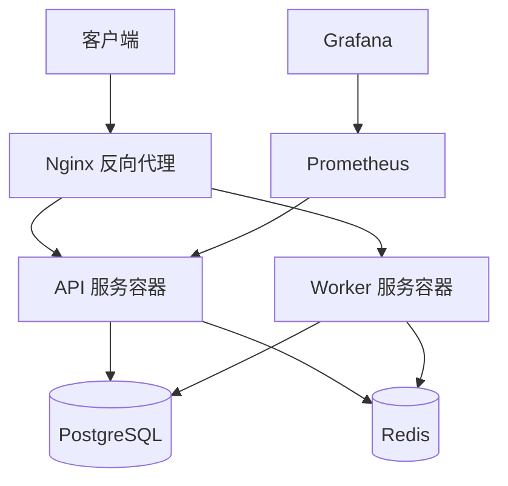

# Docker 部署指南

本文档说明如何使用 Docker 和 Docker Compose 部署项目。

## 📋 目录

- [部署架构](#部署架构)
- [本地开发](#本地开发)
- [生产部署](#生产部署)
- [Dockerfile 说明](#dockerfile-说明)
- [Docker Compose 配置](#docker-compose-配置)
- [环境变量](#环境变量)
- [日志管理](#日志管理)
- [备份与恢复](#备份与恢复)

## 部署架构



**服务清单**：
| 服务 | 端口 | 说明 |
|------|------|------|
| **api** | 8080 | API 服务 |
| **worker** | - | 异步任务 Worker |
| **postgres** | 5432 | 数据库 |
| **redis** | 6379 | 缓存 |
| **prometheus** | 9090 | 指标采集 |
| **grafana** | 3000 | 监控仪表板 |

## 本地开发

### 快速启动

```bash
# 1. 启动基础设施（仅数据库和缓存）
docker-compose up -d postgres redis

# 2. 等待服务就绪
sleep 10

# 3. 运行数据库迁移
cd backend
make migrate up

# 4. 本地启动 API 服务（热重载）
make run api
```

**优势**：
- ✅ API 服务本地运行，支持热重载
- ✅ 基础设施容器化，环境一致
- ✅ 快速调试和开发

### 完整容器化（可选）

```bash
# 启动所有服务（包括 API 和 Worker）
docker-compose up -d

# 查看日志
docker-compose logs -f api

# 停止所有服务
docker-compose down
```

## 生产部署

### 前置准备

**服务器要求**：
- CPU: 2 核+
- 内存: 4GB+
- 磁盘: 20GB+
- 操作系统: Ubuntu 20.04+ / CentOS 8+

**必需软件**：
```bash
# 安装 Docker
curl -fsSL https://get.docker.com | sh

# 安装 Docker Compose
sudo curl -L "https://github.com/docker/compose/releases/latest/download/docker-compose-$(uname -s)-$(uname -m)" -o /usr/local/bin/docker-compose
sudo chmod +x /usr/local/bin/docker-compose

# 验证安装
docker --version
docker-compose --version
```

### 部署步骤

#### 步骤 1：克隆项目

```bash
git clone <repository-url> /opt/ddd-scaffold
cd /opt/ddd-scaffold
```

#### 步骤 2：配置环境变量

```bash
# 创建生产环境配置
cp backend/configs/.env.example backend/configs/.env.production

# 编辑配置
vim backend/configs/.env.production
```

**关键配置**：
```env
# 服务器
SERVER_PORT=8080
SERVER_MODE=release

# 数据库
DB_HOST=postgres
DB_PORT=5432
DB_USER=ddd_scaffold
DB_PASSWORD=<强密码>
DB_NAME=ddd_scaffold

# Redis
REDIS_HOST=redis
REDIS_PORT=6379
REDIS_PASSWORD=<强密码>

# JWT
JWT_SECRET=<强随机字符串>
JWT_ACCESS_TOKEN_EXPIRY=15m
JWT_REFRESH_TOKEN_EXPIRY=7d

# 日志
LOG_LEVEL=info
LOG_FORMAT=json
```

#### 步骤 3：构建镜像

```bash
# 构建生产镜像
docker-compose build api worker

# 查看镜像
docker images | grep ddd-scaffold
```

#### 步骤 4：启动服务

```bash
# 启动所有服务
docker-compose up -d

# 检查服务状态
docker-compose ps

# 预期输出：
#       Name                     Command               State          Ports
# -----------------------------------------------------------------------------------
# ddd-scaffold-api      /app/api                       Up      0.0.0.0:8080->8080/tcp
# ddd-scaffold-postgres docker-entrypoint.sh postgres  Up      5432/tcp
# ddd-scaffold-redis    docker-entrypoint.sh redis ... Up      6379/tcp
# ddd-scaffold-worker   /app/worker                    Up
```

#### 步骤 5：运行数据库迁移

```bash
# 进入 API 容器
docker-compose exec api sh

# 运行迁移
./cli migrate up

# 退出容器
exit
```

#### 步骤 6：验证部署

```bash
# 健康检查
curl http://localhost:8080/health

# 预期响应：
# {"status":"healthy","timestamp":"2026-04-08T10:00:00Z"}

# 访问 Swagger 文档
open http://localhost:8080/swagger/index.html
```

### 常用运维命令

```bash
# 查看日志
docker-compose logs -f api
docker-compose logs -f worker
docker-compose logs -f postgres

# 重启服务
docker-compose restart api
docker-compose restart worker

# 停止服务
docker-compose stop
docker-compose start

# 完全停止并删除容器
docker-compose down

# 查看资源使用
docker stats

# 清理未使用的镜像
docker image prune -a
```

## Dockerfile 说明

### API 服务 Dockerfile

**位置**：`backend/Dockerfile`

```dockerfile
# 构建阶段
FROM golang:1.21-alpine AS builder

WORKDIR /app

# 安装依赖
RUN apk add --no-cache git

# 复制依赖文件
COPY go.mod go.sum ./
RUN go mod download

# 复制源代码
COPY . .

# 构建二进制文件
RUN CGO_ENABLED=0 GOOS=linux go build -a -installsuffix cgo \
    -ldflags="-w -s" \
    -o /app/bin/api \
    ./cmd/api

# 运行阶段
FROM alpine:latest

WORKDIR /app

# 安装必要工具
RUN apk add --no-cache ca-certificates tzdata

# 复制二进制文件
COPY --from=builder /app/bin/api /app/api
COPY --from=builder /app/configs /app/configs

# 设置时区
ENV TZ=Asia/Shanghai

# 暴露端口
EXPOSE 8080

# 健康检查
HEALTHCHECK --interval=30s --timeout=3s --start-period=5s --retries=3 \
    CMD wget --no-verbose --tries=1 --spider http://localhost:8080/health || exit 1

# 启动命令
CMD ["/app/api"]
```

**多阶段构建优势**：
- ✅ 最终镜像体积小（~20MB）
- ✅ 不包含源码和构建工具
- ✅ 更安全（无 Git、编译器）

### Worker 服务 Dockerfile

与 API 类似，仅启动命令不同：

```dockerfile
# ... 构建阶段相同 ...

# 运行阶段
FROM alpine:latest

WORKDIR /app

RUN apk add --no-cache ca-certificates tzdata

COPY --from=builder /app/bin/worker /app/worker
COPY --from=builder /app/configs /app/configs

ENV TZ=Asia/Shanghai

CMD ["/app/worker"]
```

## Docker Compose 配置

**位置**：根目录 `docker-compose.yml`

```yaml
version: '3.8'

services:
  # API 服务
  api:
    build:
      context: ./backend
      dockerfile: Dockerfile
    ports:
      - "8080:8080"
    environment:
      - DB_HOST=postgres
      - REDIS_HOST=redis
    env_file:
      - ./backend/configs/.env.production
    depends_on:
      - postgres
      - redis
    restart: unless-stopped
    networks:
      - ddd-network

  # Worker 服务
  worker:
    build:
      context: ./backend
      dockerfile: Dockerfile.worker
    environment:
      - DB_HOST=postgres
      - REDIS_HOST=redis
    env_file:
      - ./backend/configs/.env.production
    depends_on:
      - postgres
      - redis
    restart: unless-stopped
    networks:
      - ddd-network

  # PostgreSQL
  postgres:
    image: postgres:14-alpine
    environment:
      - POSTGRES_USER=ddd_scaffold
      - POSTGRES_PASSWORD=${DB_PASSWORD:-secret}
      - POSTGRES_DB=ddd_scaffold
    volumes:
      - postgres-data:/var/lib/postgresql/data
    ports:
      - "5432:5432"
    restart: unless-stopped
    networks:
      - ddd-network

  # Redis
  redis:
    image: redis:7-alpine
    command: redis-server --requirepass ${REDIS_PASSWORD:-secret}
    volumes:
      - redis-data:/data
    ports:
      - "6379:6379"
    restart: unless-stopped
    networks:
      - ddd-network

volumes:
  postgres-data:
  redis-data:

networks:
  ddd-network:
    driver: bridge
```

**配置说明**：
- `depends_on` - 确保依赖服务先启动
- `restart: unless-stopped` - 自动重启（除非手动停止）
- `volumes` - 数据持久化
- `networks` - 网络隔离

## 环境变量

### 完整环境变量清单

| 变量名 | 默认值 | 说明 | 必需 |
|--------|--------|------|------|
| `SERVER_PORT` | 8080 | HTTP 服务端口 | 否 |
| `SERVER_MODE` | release | 运行模式（debug/release） | 否 |
| `DB_HOST` | localhost | 数据库主机 | 是 |
| `DB_PORT` | 5432 | 数据库端口 | 否 |
| `DB_USER` | postgres | 数据库用户 | 是 |
| `DB_PASSWORD` | - | 数据库密码 | 是 |
| `DB_NAME` | ddd_scaffold | 数据库名称 | 是 |
| `REDIS_HOST` | localhost | Redis 主机 | 是 |
| `REDIS_PORT` | 6379 | Redis 端口 | 否 |
| `REDIS_PASSWORD` | - | Redis 密码 | 是 |
| `JWT_SECRET` | - | JWT 密钥 | 是 |
| `JWT_ACCESS_TOKEN_EXPIRY` | 15m | 访问令牌过期时间 | 否 |
| `JWT_REFRESH_TOKEN_EXPIRY` | 7d | 刷新令牌过期时间 | 否 |
| `LOG_LEVEL` | info | 日志级别 | 否 |
| `LOG_FORMAT` | json | 日志格式（json/console） | 否 |

### 生成安全密钥

```bash
# 生成 JWT Secret
openssl rand -base64 32

# 生成数据库密码
openssl rand -base64 24

# 生成 Redis 密码
openssl rand -base64 24
```

## 日志管理

### 查看日志

```bash
# 查看 API 日志
docker-compose logs -f api

# 查看最近 100 行
docker-compose logs --tail=100 api

# 带时间戳
docker-compose logs -f -t api
```

### 日志持久化

**修改 docker-compose.yml**：
```yaml
services:
  api:
    logging:
      driver: "json-file"
      options:
        max-size: "10m"
        max-file: "3"
```

**配置说明**：
- `max-size` - 单个日志文件最大 10MB
- `max-file` - 保留 3 个日志文件

### 日志收集（生产环境）

使用 ELK Stack 或 Loki：

```yaml
# docker-compose.override.yml
services:
  api:
    logging:
      driver: "fluentd"
      options:
        fluentd-address: localhost:24224
        tag: ddd-scaffold.api
```

## 备份与恢复

### 数据库备份

```bash
# 备份数据库
docker-compose exec postgres pg_dump -U ddd_scaffold ddd_scaffold > backup_$(date +%Y%m%d_%H%M%S).sql

# 压缩备份
docker-compose exec postgres pg_dump -U ddd_scaffold ddd_scaffold | gzip > backup_$(date +%Y%m%d_%H%M%S).sql.gz
```

### 数据库恢复

```bash
# 恢复数据库
cat backup_20260408_100000.sql | docker-compose exec -T postgres psql -U ddd_scaffold ddd_scaffold

# 恢复压缩备份
gunzip -c backup_20260408_100000.sql.gz | docker-compose exec -T postgres psql -U ddd_scaffold ddd_scaffold
```

### 自动备份脚本

```bash
#!/bin/bash
# backup.sh

BACKUP_DIR="/opt/backups/ddd-scaffold"
DATE=$(date +%Y%m%d_%H%M%S)
BACKUP_FILE="$BACKUP_DIR/backup_$DATE.sql.gz"

# 创建备份目录
mkdir -p $BACKUP_DIR

# 执行备份
docker-compose exec -T postgres pg_dump -U ddd_scaffold ddd_scaffold | gzip > $BACKUP_FILE

# 删除 7 天前的备份
find $BACKUP_DIR -name "backup_*.sql.gz" -mtime +7 -delete

echo "Backup completed: $BACKUP_FILE"
```

**添加 cron 任务**：
```bash
# 每天凌晨 2 点备份
0 2 * * * /opt/ddd-scaffold/scripts/backup.sh
```

## 性能调优

### PostgreSQL 优化

```yaml
# docker-compose.yml
services:
  postgres:
    command: >
      postgres
      -c shared_buffers=256MB
      -c effective_cache_size=1GB
      -c maintenance_work_mem=64MB
      -c max_connections=100
```

### Redis 优化

```yaml
services:
  redis:
    command: >
      redis-server
      --requirepass ${REDIS_PASSWORD}
      --maxmemory 256mb
      --maxmemory-policy allkeys-lru
      --appendonly yes
```

### API 服务优化

```yaml
services:
  api:
    deploy:
      resources:
        limits:
          cpus: '2'
          memory: 1G
        reservations:
          cpus: '1'
          memory: 512M
```

## 📚 延伸阅读

- [监控配置](MONITORING_SETUP.md) - Prometheus + Grafana 配置
- [生产检查清单](PRODUCTION_CHECKLIST.md) - 上线前检查
- [故障排查](../operations/TROUBLESHOOTING.md) - 常见问题解决
