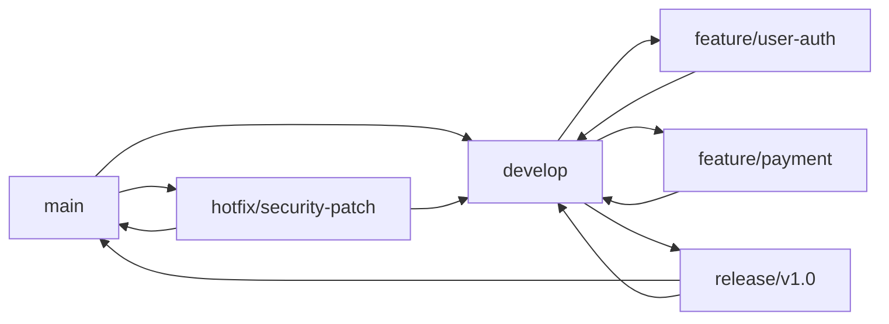

# 开发指南

本文档说明项目的开发规范、工作流程和最佳实践。

## 📋 目录

- [开发环境配置](#开发环境配置)
- [代码规范](#代码规范)
- [Git 工作流](#git-工作流)
- [测试规范](#测试规范)
- [数据库迁移](#数据库迁移)
- [API 开发流程](#api-开发流程)
- [代码审查](#代码审查)
- [调试技巧](#调试技巧)

## 开发环境配置

### 推荐 IDE 配置

#### VS Code

安装扩展：
- **Go**（官方 Go 语言支持）
- **GitLens**（Git 增强）
- **REST Client**（API 测试）
- **Swagger Viewer**（Swagger 预览）

**settings.json 配置**：
```json
{
  "go.lintTool": "golangci-lint",
  "go.lintOnSave": "workspace",
  "go.formatTool": "goimports",
  "editor.formatOnSave": true,
  "editor.codeActionsOnSave": {
    "source.organizeImports": true
  }
}
```

#### GoLand

启用以下功能：
- **Settings → Go → Go Modules** → 启用 Go Modules 集成
- **Settings → Editor → Actions on Save** → 启用 Organize imports、Rearrange code
- **Settings → Tools → File Watchers** → 添加 goimports

### 开发工具安装

```bash
# 代码格式化
go install golang.org/x/tools/cmd/goimports@latest

# 代码检查
go install github.com/golangci/golangci-lint/cmd/golangci-lint@latest

# Mock 生成
go install github.com/vektra/mockery/v2@latest

# Swagger 文档生成
go install github.com/swaggo/swag/cmd/swag@latest

# 数据库迁移工具
go install -tags 'postgres' github.com/golang-migrate/migrate/v4/cmd/migrate@latest
```

## 代码规范

### Go 代码规范

遵循 [Effective Go](https://go.dev/doc/effective_go) 和 [Go Code Review Comments](https://github.com/golang/go/wiki/CodeReviewComments)

**关键规则**：
1. ✅ 使用 `goimports` 格式化代码
2. ✅ 公开标识符使用大写字母开头
3. ✅ 错误处理不省略（`if err != nil`）
4. ✅ 变量命名简洁明确
5. ✅ 函数长度控制在 50 行以内

### 命名规范

```go
// ✅ 好的命名
var userCount int
func GetUserByID(id string) (*User, error)
type UserRepository interface { ... }

// ❌ 不好的命名
var uC int                     // 太简短，不清晰
func GetUserByIDFromDatabase(id string) (*User, error)  // 冗余
type IUserRepository interface { ... }  // Go 不需要 I 前缀
```

### 错误处理

**统一使用 AppError**：
```go
// 定义错误码（pkg/errors/user/errors.go）
var (
    ErrUserNotFound     = errors.New("USER.NOT_FOUND", "用户不存在", http.StatusNotFound)
    ErrEmailExists      = errors.New("USER.EMAIL_EXISTS", "邮箱已存在", http.StatusConflict)
)

// 使用错误
func (s *Service) GetUser(ctx context.Context, id string) (*User, error) {
    user, err := s.repo.FindByID(ctx, id)
    if err != nil {
        return nil, userErr.ErrUserNotFound
    }
    return user, nil
}
```

### 注释规范

详见 [代码注释规范](CODE_COMMENT_GUIDELINES.md)

**快速参考**：
- **Handler 层**：Swagger + 完整注释
- **Service 层**：业务流程注释
- **Domain 层**：简洁注释
- **字段注释**：行内注释

## Git 工作流

### 分支策略



**分支说明**：
- `main` - 生产环境代码（受保护）
- `develop` - 开发环境代码
- `feature/*` - 功能分支
- `release/*` - 发布分支
- `hotfix/*` - 热修复分支

### 提交规范

使用 [Conventional Commits](https://www.conventionalcommits.org/) 规范：

```
<type>(<scope>): <description>

[optional body]

[optional footer(s)]
```

**Type 类型**：
- `feat` - 新功能
- `fix` - Bug 修复
- `docs` - 文档更新
- `style` - 代码格式（不影响功能）
- `refactor` - 重构
- `perf` - 性能优化
- `test` - 测试相关
- `chore` - 构建/工具链

**示例**：
```bash
# 新功能
git commit -m "feat(auth): 添加用户注册接口"

# Bug 修复
git commit -m "fix(auth): 修复登录时密码验证逻辑"

# 文档
git commit -m "docs(api): 更新认证 API 文档"

# 重构
git commit -m "refactor(domain): 重构 User 聚合根"

# 性能优化
git commit -m "perf(db): 优化用户查询索引"
```

### 开发流程

```bash
# 1. 从 develop 创建功能分支
git checkout develop
git pull origin develop
git checkout -b feature/user-registration

# 2. 开发并提交
git add -A
git commit -m "feat(auth): 实现用户注册功能"

# 3. 推送到远程
git push origin feature/user-registration

# 4. 创建 Pull Request
# 在 GitHub/GitLab 上创建 PR 到 develop 分支

# 5. 代码审查通过后合并
# 使用 Squash and Merge 保持历史清晰
```

## 测试规范

### 测试分类

| 测试类型 | 位置 | 说明 | 运行命令 |
|---------|------|------|---------|
| **单元测试** | `*_test.go` | 测试单个函数/方法 | `make test-short` |
| **集成测试** | `test/integration/` | 测试多个组件交互 | `make test` |
| **E2E 测试** | `scripts/testing/` | 端到端流程测试 | `make test-e2e` |

### 单元测试示例

```go
func TestUser_NewUser(t *testing.T) {
    tests := []struct {
        name     string
        email    string
        password string
        wantErr  bool
    }{
        {
            name:     "valid user",
            email:    "test@example.com",
            password: "StrongP@ss123",
            wantErr:  false,
        },
        {
            name:     "invalid email",
            email:    "invalid-email",
            password: "StrongP@ss123",
            wantErr:  true,
        },
        {
            name:     "weak password",
            email:    "test@example.com",
            password: "123",
            wantErr:  true,
        },
    }
    
    for _, tt := range tests {
        t.Run(tt.name, func(t *testing.T) {
            user, err := user.NewUser(tt.email, tt.password)
            if (err != nil) != tt.wantErr {
                t.Errorf("NewUser() error = %v, wantErr %v", err, tt.wantErr)
                return
            }
            if !tt.wantErr && user == nil {
                t.Error("NewUser() returned nil user")
            }
        })
    }
}
```

### 测试覆盖率

```bash
# 生成覆盖率报告
make coverage

# 查看覆盖率（目标 > 80%）
go tool cover -func=coverage.out
```

### Mock 使用

使用 `mockery` 生成 Mock：

```bash
# 生成 Repository Mock
mockery --name=UserRepository --dir=internal/domain/user --output=internal/domain/user/mocks

# 在测试中使用
func TestService_Register(t *testing.T) {
    mockRepo := mocks.NewUserRepository(t)
    mockRepo.On("ExistsByEmail", mock.Anything, "test@example.com").Return(false)
    mockRepo.On("Create", mock.Anything, mock.AnythingOfType("*user.User")).Return(nil)
    
    service := authentication.NewService(mockRepo, nil)
    resp, err := service.Register(context.Background(), cmd)
    
    assert.NoError(t, err)
    assert.NotNil(t, resp)
    mockRepo.AssertExpectations(t)
}
```

## 数据库迁移

### 迁移文件命名

迁移文件按表归组，命名规范为 `{序号}_{操作}_{表名}.{up|down}.sql`：

```
migrations/
├── 001_create_users_table.up.sql
├── 001_create_users_table.down.sql
├── 002_create_email_verification_tokens_table.up.sql
├── 002_create_email_verification_tokens_table.down.sql
├── 003_create_password_reset_tokens_table.up.sql
├── 003_create_password_reset_tokens_table.down.sql
├── 004_create_rbac_tables.up.sql              -- 角色 + 用户角色 + Casbin 策略
├── 004_create_rbac_tables.down.sql
├── 005_create_menus_table.up.sql              -- 菜单管理
├── 005_create_menus_table.down.sql
├── 006_create_operation_logs_table.up.sql     -- 统一操作日志
├── 006_create_operation_logs_table.down.sql
├── 007_seed_roles_and_permissions.up.sql      -- 角色与权限种子数据
├── 007_seed_roles_and_permissions.down.sql
├── 008_seed_menus.up.sql                      -- 菜单种子数据
├── 008_seed_menus.down.sql
├── 009_seed_founder.up.sql                    -- 创始人账号种子数据
└── 009_seed_founder.down.sql
```

**规则**：
- 三位数字前缀统一（001-009…）
- 同一张表/同一组功能的迁移文件共享同一序号
- 描述性名称（`create_users_table`、`create_rbac_tables`）
- Seed 数据使用 `seed_` 前缀（`seed_roles_and_permissions`）
- `.up.sql` - 正向迁移
- `.down.sql` - 回滚迁移

### 编写迁移脚本

**正向迁移**（`002_create_email_verification_tokens_table.up.sql`）：
```sql
CREATE TABLE IF NOT EXISTS email_verification_tokens (
    id VARCHAR(50) PRIMARY KEY,
    user_id VARCHAR(50) NOT NULL REFERENCES users(id) ON DELETE CASCADE,
    token VARCHAR(255) NOT NULL UNIQUE,
    expires_at TIMESTAMP NOT NULL,
    used BOOLEAN DEFAULT FALSE,
    created_at TIMESTAMP DEFAULT NOW()
);

CREATE INDEX idx_email_verification_tokens_user_id ON email_verification_tokens(user_id);
CREATE INDEX idx_email_verification_tokens_token ON email_verification_tokens(token);
```

**回滚迁移**（`002_create_email_verification_tokens_table.down.sql`）：
```sql
DROP TABLE IF EXISTS email_verification_tokens;
```

### 执行迁移

```bash
# 执行所有迁移
make migrate up

# 回滚最后一步迁移
make migrate down

# 查看迁移状态
make db-status
```

## API 开发流程

### 新增 API 端点

**步骤 1：定义领域模型**（如需要）

```go
// internal/domain/user/entity.go
type User struct { ... }
```

**步骤 2：定义仓储接口**

```go
// internal/domain/user/repository.go
type UserRepository interface {
    FindByID(ctx context.Context, id string) (*User, error)
}
```

**步骤 3：实现仓储**

```go
// internal/infra/repository/user.go
type UserRepository struct {
    db *gorm.DB
}

func (r *UserRepository) FindByID(ctx context.Context, id string) (*User, error) {
    // 实现...
}
```

**步骤 4：创建应用服务**

```go
// internal/app/user/service.go
type Service struct {
    repo user.UserRepository
}

func (s *Service) GetUser(ctx context.Context, id string) (*UserDTO, error) {
    // 业务逻辑...
}
```

**步骤 5：创建 Handler**

```go
// internal/transport/http/handlers/user.go
func (h *UserHandler) GetUser(c *gin.Context) {
    id := c.Param("id")
    
    user, err := h.service.GetUser(c.Request.Context(), id)
    if err != nil {
        response.Error(c, err)
        return
    }
    
    response.Success(c, user)
}
```

**步骤 6：注册路由**

```go
// internal/transport/http/router.go
func NewRouter(userHandler *handlers.UserHandler) *gin.Engine {
    router := gin.New()
    
    api := router.Group("/api/v1")
    {
        users := api.Group("/users")
        {
            users.GET("/:id", userHandler.GetUser)
        }
    }
    
    return router
}
```

**步骤 7：添加 Swagger 注释**

```go
// GetUser 根据 ID 获取用户信息
//
// @Summary 获取用户详情
// @Tags Users
// @Param id path string true "用户 ID"
// @Success 200 {object} middleware.SuccessResponse{data=user.UserDTO} "用户信息"
// @Failure 404 {object} middleware.ErrorResponse "用户不存在"
// @Router /users/{id} [get]
func (h *UserHandler) GetUser(c *gin.Context) {
    // ...
}
```

**步骤 8：生成文档**

```bash
make swagger gen
```

## 代码审查

### PR 检查清单

提交 PR 前自查：

- [ ] 代码通过 `make vet` 检查
- [ ] 代码通过 `make fmt` 格式化
- [ ] 添加必要的单元测试
- [ ] 更新 Swagger 文档（如修改 API）
- [ ] 更新相关文档（如架构变更）
- [ ] 提交信息符合 Conventional Commits
- [ ] 无敏感信息（密码、密钥等）
- [ ] 数据库迁移脚本有 up 和 down

### Code Review 要点

**审查者关注**：
1. ✅ 业务逻辑正确性
2. ✅ 错误处理完整性
3. ✅ 边界条件处理
4. ✅ 性能影响
5. ✅ 安全性（SQL 注入、XSS 等）
6. ✅ 代码可读性
7. ✅ 测试覆盖率

## 调试技巧

### 日志调试

```go
// 使用结构化日志
logger.Info("用户注册成功", 
    "user_id", user.ID,
    "email", user.Email,
    "ip", c.ClientIP(),
)

// 错误日志
logger.Error("创建用户失败",
    "error", err,
    "email", cmd.Email,
)
```

### HTTP 请求调试

使用 `httpie` 或 `curl`：

```bash
# 安装 httpie
brew install httpie

# 发送请求（更友好的输出）
http POST http://localhost:8080/api/v1/auth/register \
    email=test@example.com \
    password=Test123456!
```

### 数据库调试

```bash
# 连接数据库
psql -U postgres -d kiqi

# 查看用户表
SELECT id, email, email_verified, created_at FROM users LIMIT 10;

# 查看索引使用情况
EXPLAIN ANALYZE SELECT * FROM users WHERE email = 'test@example.com';
```

### Redis 调试

```bash
# 连接 Redis
redis-cli

# 查看所有 Key
KEYS *

# 查看特定 Key
GET user:session:01JQMXYZ...

# 清空数据库（开发环境）
FLUSHDB
```

## 权限系统开发指南

### Casbin 权限引擎配置

项目使用 **Casbin v3** + **gorm-adapter/v3** 作为权限决策引擎。

**核心依赖**（`go.mod`）：
```go
github.com/casbin/casbin/v3          // 权限引擎
github.com/casbin/gorm-adapter/v3    // PostgreSQL 持久化适配器
```

**配置文件**（`configs/rbac_model.conf`）：
```
[request_definition]
r = sub, obj, act

[policy_definition]
p = sub, obj, act

[role_definition]
g = _, _

[policy_effect]
e = some(where (p.eft == allow))

[matchers]
m = g(r.sub, p.sub) && r.obj == p.obj && r.act == p.act
```

### 新增权限策略

**步骤 1：在 seed 迁移中添加角色和策略**

```sql
-- 添加角色
INSERT INTO roles (id, name, code) VALUES ('role-id', '管理员', 'ADMIN');

-- 添加 Casbin 策略（角色对资源的访问权限）
INSERT INTO casbin_rule (ptype, v0, v1, v2) VALUES ('p', 'ADMIN', '/api/v1/users', 'GET');

-- 分配用户角色
INSERT INTO casbin_rule (ptype, v0, v1) VALUES ('g', 'user-id', 'ADMIN');
```

**步骤 2：在路由中配置中间件**

```go
// router.go
api.Use(middleware.RBAC(enforcer))
```

**步骤 3：前端配置权限标识**

前端通过 `PermissionGuard` 组件和路由的 `permission` 属性进行权限控制，权限标识与后端 Casbin 策略中的 `v1`（资源路径）对应。

### 操作日志开发

操作日志通过领域事件驱动自动记录，无需在业务代码中手动调用。

**事件发布 → 监听器 → 持久化**：
1. 聚合根发布领域事件（如 `UserLoggedIn`）
2. `OperationLogListener` 监听事件并转换为 `OperationLog` 实体
3. 通过异步队列持久化到数据库

**新增操作日志类型**：
1. 在聚合根中发布新的领域事件
2. 在 `OperationLogListener` 中添加事件到 OperationLog 的转换逻辑
3. 定义 `action` 命名格式：`{Category}.{Resource}.{Action}.{Result}`

## 📚 延伸阅读

- [代码注释规范](CODE_COMMENT_GUIDELINES.md) - 注释规范详解
- [DDD 架构设计](../architecture/DDD_ARCHITECTURE.md) - 架构理念
- [领域模型](../architecture/DOMAIN_MODEL.md) - 聚合根、值对象设计
- [快速开始](GETTING_STARTED.md) - 环境搭建
