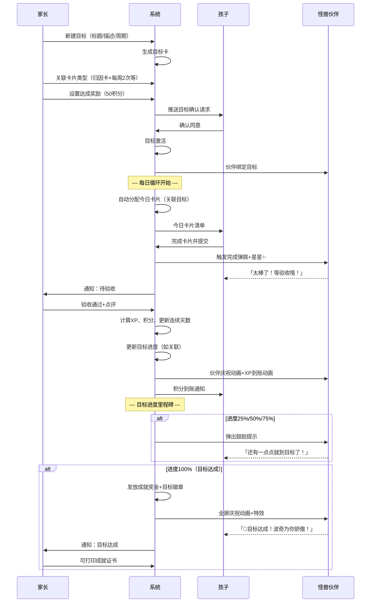
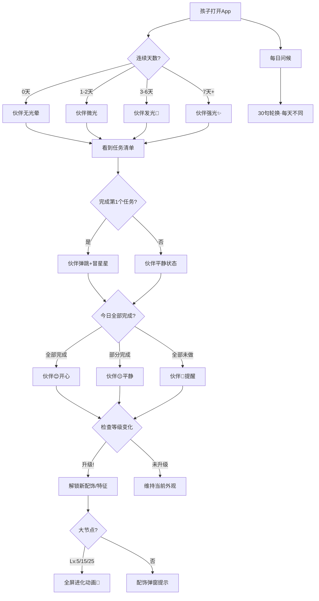
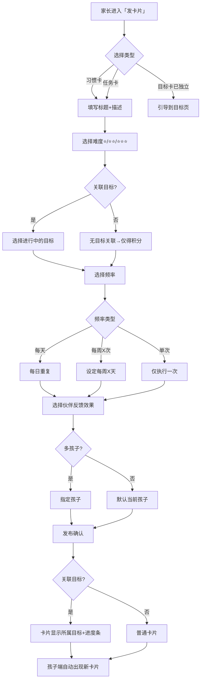
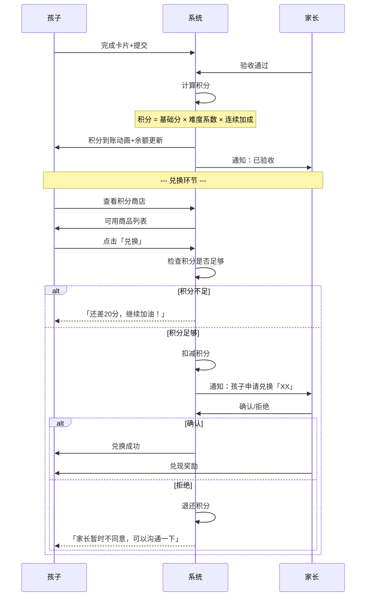
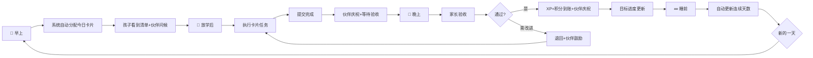

---
AIGC:
    Label: "1"
    ContentProducer: 001191110102MACQD9K64018705
    ProduceID: 402890346727492_0/project_7649927732410925353-files/docs/巧记成长_核心交互流程图.md
    ReservedCode1: ""
    ContentPropagator: 001191110102MACQD9K64028705
    PropagateID: 402890346727492#1783306133209
    ReservedCode2: ""
---
# 巧记成长·核心交互流程图

> 文档版本：v2 | 2026-07-03
> 使用 Mermaid 格式，可直接在支持 Mermaid 的编辑器中渲染

---

## 1. 全链路闭环：设定目标到目标达成



---

## 2. 伙伴三层反馈触发流程



---

## 3. 伙伴升级与解锁流程

```mermaid
flowchart TD
    A[获取XP] --> B[计算等级 = floor(总XP/100)+1]
    B --> C{等级变化?}
    C -->|不变| D[无变化]
    C -->|升1级| E[检查等级解锁表]
    
    E --> F{解锁类型}
    F -->|配饰| G[弹出「伙伴获得了新帽子!」]
    F -->|特效| H[特效自动生效]
    F -->|表情| I[新表情加入轮换]
    F -->|音效| J[音效升级]
    
    F --> K{进化节点?}
    K -->|Lv.5| L{完成第一个月目标?}
    K -->|Lv.15| M{累计80项任务?}
    K -->|Lv.25| N{完成重大目标?}
    
    L -->|是| O[全屏进化动画]
    L -->|否| P[升级达成,等待目标完成后进化]
    M -->|是| O
    M -->|否| P
    N -->|是| O
    N -->|否| P
    
    O --> Q[伙伴造型变化]
    Q --> R[拍照纪念]
    R --> S[家长端收到进化通知]
```

---

## 4. 家长发布卡片流程



---

## 5. 积分获取与兑换流程



---

## 6. 每日循环总览



---

> 文档版本 v2 · 2026-07-03
> 共6张流程图：闭环链路 / 伙伴反馈 / 升级解锁 / 发布卡片 / 积分兑换 / 每日循环

---

> 本内容由 Coze AI 生成，请遵循相关法律法规及《人工智能生成合成内容标识办法》使用与传播。
